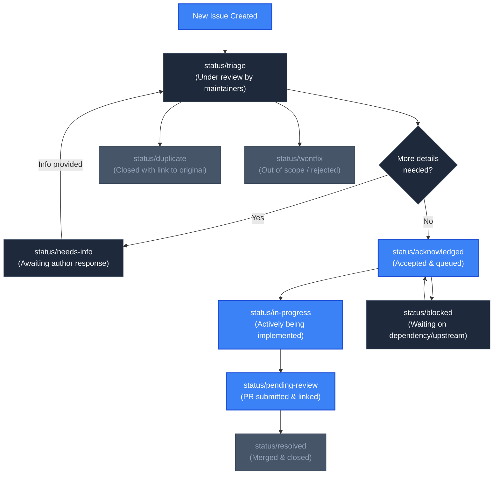

# Contributing to plan-parse

First off, thank you for considering contributing to `plan-parse`! 🎉 Tools like this exist and improve because of developers, platform engineers, and community members like you who take the time to report issues, suggest enhancements, and submit code improvements.

This document provides guidelines, workflows, and standards for contributing to the `plan-parse` project. Following these guidelines helps maintain project quality, speeds up review cycles, and ensures a seamless experience for everyone.

---

## Table of Contents

- [Code of Conduct](#code-of-conduct)
- [How Can I Contribute?](#how-can-i-contribute)
- [Process for Raising Issues](#process-for-raising-issues)
  - [1. Check for Existing or Duplicate Issues](#1-check-for-existing-or-duplicate-issues)
  - [2. Reporting Bugs](#2-reporting-bugs)
  - [3. Suggesting Features & Enhancements](#3-suggesting-features--enhancements)
  - [4. Security Vulnerabilities](#4-security-vulnerabilities)
- [Monitoring Issue & Feature Status with Tags](#monitoring-issue--feature-status-with-tags)
  - [Issue Lifecycle](#issue-lifecycle)
  - [Label Taxonomy & Categories](#label-taxonomy--categories)
  - [How to Track Progress](#how-to-track-progress)
  - [Claiming an Issue](#claiming-an-issue)
- [Development Environment Setup](#development-environment-setup)
  - [Prerequisites](#prerequisites)
  - [Repository Layout](#repository-layout)
  - [Forking & Cloning](#forking--cloning)
  - [Build Commands](#build-commands)
  - [Running the Local Development Server](#running-the-local-development-server)
  - [Running Tests](#running-tests)
  - [Linting & Code Style](#linting--code-style)
- [Pull Request (PR) Process](#pull-request-pr-process)
  - [Branch Naming Conventions](#branch-naming-conventions)
  - [Commit Message Guidelines](#commit-message-guidelines)
  - [Submitting a Pull Request](#submitting-a-pull-request)
  - [Review Process & CI Checks](#review-process--ci-checks)
- [Release Process & Versioning](#release-process--versioning)
- [Need Help?](#need-help)

---

## Code of Conduct

This project and everyone participating in it is governed by the [Contributor Covenant Code of Conduct](CODE_OF_CONDUCT.md). By participating, you are expected to uphold this code. Please report unacceptable behavior to [aatir.nadim@gmail.com](mailto:aatir.nadim@gmail.com).

---

## How Can I Contribute?

There are many ways to contribute to `plan-parse`:

* **Report Bugs**: Help us discover and eliminate bugs by reporting edge cases, unexpected crashes, or rendering issues.
* **Suggest Features**: Propose new visual DAG features, Terraform/OpenTofu version compatibility, or CLI options.
* **Submit Pull Requests**: Fix reported bugs, optimize DAG rendering performance, or implement requested features.
* **Improve Documentation**: Enhance README guides, CLI flag documentation, architectural diagrams, or code docstrings.
* **Share Fixtures & Test Data**: Provide sanitized Terraform plan outputs to expand our test coverage across various cloud providers (AWS, GCP, Azure, Kubernetes, etc.).

---

## Process for Raising Issues

Before creating a new issue, please follow this step-by-step process to maintain an organized, high-signal issue tracker.

### 1. Check for Existing or Duplicate Issues

> [!IMPORTANT]
> **Always search before opening a new issue.** A duplicate issue fragments discussion, splits maintainer focus, and slows down resolution.

Before submitting an issue:

1. **Search Open and Closed Issues**: A solution or workaround may already be documented in a closed issue, or someone may already be actively working on it.
   - Go to [plan-parse Issues](https://github.com/AatirNadim/plan-parse/issues).
   - Clear the default `is:open` filter to search both open and closed issues:
     ```text
     is:issue "your error message or keyword"
     ```
2. **Filter by Labels**: Look through relevant labels to see active work in the area:
   - For bugs: `is:issue label:kind/bug <keyword>`
   - For feature proposals: `is:issue label:kind/feature <keyword>`
   - By component: `is:issue label:area/ui <keyword>` or `is:issue label:area/core <keyword>`
3. **Check Pull Requests**: The fix or feature might already be under review in an open pull request:
   - Search [plan-parse Pull Requests](https://github.com/AatirNadim/plan-parse/pulls):
     ```text
     is:pr <keyword>
     ```

If you find an existing issue that matches yours:
- **Add a reaction** (e.g. 👍) to express interest without cluttering the conversation with `+1` comments.
- **Add valuable context** as a comment if you have additional reproduction steps, error logs, or environment variations not already mentioned.
- **Subscribe to notifications** on the right sidebar to receive updates as work progresses.

### 2. Reporting Bugs

If you have verified that no duplicate exists, please open a bug report using our [Bug Report Form](https://github.com/AatirNadim/plan-parse/issues/new?template=bug_report.yml).

A great bug report includes:
* **Clear, descriptive title**: Summarize the symptom (e.g., `core: cyclic dependency error when parsing multi-stage module with depends_on`).
* **Environment details**:
  - `plan-parse` version (or commit SHA)
  - Operating system & architecture (`uname -a`)
  - Go version (`go version`)
  - Terraform or OpenTofu version (`terraform version` or `tofu version`)
  - Browser name and version (for UI/rendering bugs)
* **Exact steps to reproduce**: Step-by-step instructions so maintainers can reproduce the behavior.
* **Expected vs. Actual behavior**: What did you anticipate happening, and what happened instead?
* **Relevant logs & error output**: Full terminal output or browser console logs (enclosed in code blocks).
* **Sanitized plan sample**: When reporting parser or graph rendering issues, include a minimal, reproducible Terraform plan JSON.

> [!CAUTION]
> **Sanitize Sensitive Data**: Never include plaintext credentials, API tokens, cloud account IDs, private IP addresses, or secrets in plan files, logs, or screenshots. Terraform plans frequently contain sensitive attributes. Sanitize before pasting!

### 3. Suggesting Features & Enhancements

We welcome proposals for new features! To propose an enhancement, use our [Feature Request Form](https://github.com/AatirNadim/plan-parse/issues/new?template=feature_request.yml).

When drafting a feature request, address:
* **The Problem**: What limitation or frustration are you experiencing? ("I cannot easily trace cross-module outputs when...")
* **The Proposed Solution**: What is your ideal outcome or workflow? How should the CLI or UI behave?
* **Alternatives Considered**: Did you consider other approaches or workarounds? Why is the proposed solution preferred?
* **Mockups or CLI Examples**: If the feature affects the UI or CLI flags, provide ASCII diagrams, mockups, or hypothetical command lines.

### 4. Security Vulnerabilities

> [!WARNING]
> **Do NOT file public GitHub issues for security vulnerabilities.**

If you discover a security vulnerability, please follow our [Security Policy](SECURITY.md) and report it privately to [aatir.nadim@gmail.com](mailto:aatir.nadim@gmail.com) or via GitHub's [Private Vulnerability Reporting](https://github.com/AatirNadim/plan-parse/security/advisories/new).

---

## Monitoring Issue & Feature Status with Tags

`plan-parse` utilizes a structured label/tag taxonomy to transparently communicate the status, area, priority, and type of every issue and feature request.

### Issue Lifecycle



### Label Taxonomy & Categories

We organize GitHub labels across five standardized prefixes:

#### 1. Status Labels (`status/*`)
Indicates the current stage of an issue in the triage and development workflow.

| Label | Description |
| :--- | :--- |
| `status/triage` | Newly submitted issue awaiting initial review and categorization by maintainers. |
| `status/needs-info` | More details, reproduction steps, or logs are required from the author before moving forward. |
| `status/acknowledged` | Confirmed valid bug or accepted feature request; added to the project backlog. |
| `status/in-progress` | A contributor is actively working on a solution. |
| `status/blocked` | Work is temporarily blocked waiting on an external dependency or upstream library. |
| `status/pending-review` | Implementation has been submitted as a Pull Request and is awaiting code review. |
| `status/resolved` | Resolved via a merged pull request; will be included in the next release. |
| `status/duplicate` | Issue has already been reported elsewhere and will be linked and closed. |
| `status/wontfix` | Issue is out of scope, not reproducible, or deemed incompatible with project architecture. |

#### 2. Kind / Type Labels (`kind/*`)
Indicates the nature of the issue or pull request.

| Label | Description |
| :--- | :--- |
| `kind/bug` | Unexpected behavior, incorrect calculation, crash, or rendering failure. |
| `kind/feature` | New capability, visual graph tool, or major addition to `plan-parse`. |
| `kind/enhancement` | Incremental improvement or polish to an existing feature, UI element, or CLI flag. |
| `kind/documentation` | Additions, corrections, or updates to documentation, diagrams, or comments. |
| `kind/performance` | Memory optimization, DAG layout performance, or load time improvement. |
| `kind/refactor` | Code restructuring or cleaning without changing observable behavior. |
| `kind/testing` | Adding test cases, testdata fixtures, or improving CI coverage. |
| `kind/security` | Vulnerability remediations, dependency audits, or security patches. |
| `kind/chore` | Repository maintenance, dependency upgrades, or CI workflow updates. |

#### 3. Area / Component Labels (`area/*`)
Identifies which architectural sub-system is touched by the issue.

| Label | Description |
| :--- | :--- |
| `area/core` | Core parser engine (`pkg/core`): schema parsing, module resolution, DAG builder. |
| `area/runner` | Terraform CLI runner (`pkg/runner`): binary discovery, temporary plan execution, error classifier. |
| `area/server` | Embedded web server (`pkg/server`): HTTP REST API endpoints, SPA asset serving. |
| `area/ui` | Next.js frontend workbench (`ui/`): Cytoscape canvas, node inspector, sidebar, palettes. |
| `area/ci-cd` | GitHub Actions, Docker images, Makefile, build scripts, release workflows. |
| `area/docs` | Project documentation, architectural guides, and guides in `pkg/*/README.md`. |

#### 4. Priority Labels (`priority/*`)
Communicates the urgency of resolving the issue.

| Label | Description |
| :--- | :--- |
| `priority/critical` | Data corruption, total application crash, or security vulnerability requiring an immediate patch release. |
| `priority/high` | Major functionality broken with no reasonable workaround. Scheduled for next immediate release. |
| `priority/medium` | Standard issue or useful feature affecting normal workflows. Handled in regular sprint cadence. |
| `priority/low` | Minor cosmetic issue, edge-case glitch, or low-urgency enhancement idea. |

#### 5. Community & Onboarding Labels
Helps new contributors discover tasks matching their skill level.

| Label | Description |
| :--- | :--- |
| `good first issue` | Well-scoped, isolated task suitable for contributors new to the codebase. |
| `help wanted` | Maintainers are actively seeking community contributions for this task. |

### How to Track Progress

* **Notifications**: Click the **Watch** button at the top of the repository or the **Subscribe** button on individual issues to receive email or web notifications when status tags change.
* **Milestones**: Check [GitHub Milestones](https://github.com/AatirNadim/plan-parse/milestones) to see which issues are targeted for upcoming releases (e.g. `v0.2.0`).
* **Filtering by Tag**: Combine search filters in GitHub Issues to monitor items of interest. For example:
  - All acknowledged UI features: `is:issue is:open label:area/ui label:kind/feature label:status/acknowledged`
  - High priority bugs being worked on: `is:issue is:open label:kind/bug label:priority/high`

### Claiming an Issue

If you'd like to work on an existing open issue:
1. Ensure the issue has the `status/acknowledged`, `good first issue`, or `help wanted` tag and is **not** already assigned or tagged `status/in-progress`.
2. Post a comment on the issue: *"I'd like to work on this issue. Please assign it to me."*
3. A maintainer will assign the issue to you and update the label to `status/in-progress`.
4. If you run into roadblocks or cannot complete the task, please leave a comment so others can take over.

---

## Development Environment Setup

### Prerequisites

Ensure you have the following tools installed locally:

* **Go**: Version `1.22` or higher (tested with Go `1.27+`). [Download Go](https://go.dev/dl/).
* **Node.js**: Version `20.x` or `22.x` LTS. [Download Node.js](https://nodejs.org/).
* **pnpm**: Version `12.x` (or `pnpm@12.4.2` as pinned in `package.json`). Install via `corepack enable` or `npm install -g pnpm`.
* **Terraform / OpenTofu**: Version `1.0+` (needed for programmatic runner integration tests).
* **Make**: GNU Make (standard on macOS and Linux).
* **golangci-lint**: Optional but recommended for local linting. [Install golangci-lint](https://golangci-lint.run/welcome/install/).

### Repository Layout

```text
plan-parse/
├── cmd/ (or main.go)        # CLI entry point and flag parsing
├── pkg/
│   ├── core/                # Schema validator, module resolver, Cytoscape DAG generator
│   ├── runner/              # Terraform/OpenTofu CLI invocation, error classifier
│   └── server/              # HTTP REST router and embedded SPA file server
├── ui/                      # Next.js 14 developer workbench SPA (React 18, Tailwind, Cytoscape)
├── testdata/                # Sample multi-tier AWS Terraform plan fixtures
├── .github/
│   ├── workflows/           # CI/CD pipelines (golangci-lint, build-test, docker, release)
│   └── ISSUE_TEMPLATE/      # Structured issue forms
├── Makefile                 # Canonical build, test, and package targets
└── Dockerfile               # Production multi-stage container build
```

### Forking & Cloning

1. Fork the repository on GitHub by clicking the **Fork** button on [AatirNadim/plan-parse](https://github.com/AatirNadim/plan-parse).
2. Clone your fork locally:
   ```bash
   git clone https://github.com/<your-username>/plan-parse.git
   cd plan-parse
   ```
3. Add the upstream repository as a remote:
   ```bash
   git remote add upstream https://github.com/AatirNadim/plan-parse.git
   git fetch upstream
   ```

### Build Commands

The root [`Makefile`](Makefile) provides standard commands for building and testing:

```bash
# 1. Build the frontend distribution (ui/out) and embed it into pkg/server/ui/
make build-ui

# 2. Build the unified plan-parse Go binary with embedded UI
make build

# 3. Clean generated build outputs and caches
make clean
```

### Running the Local Development Server

You can run the application in two ways during development:

#### Option A: Unified Binary (Standard)
```bash
make build
./plan-parse -plan testdata/plan.json
```
Navigate to `http://localhost:8080` in your browser.

#### Option B: Decoupled Hot-Reloading Development (Frontend + Backend)
When modifying the Next.js UI, you can run the UI dev server with instantaneous hot module reloading:

1. **Terminal 1 (Backend API)**:
   ```bash
   go run main.go -plan testdata/plan.json -port 8080 -no-browser
   ```
2. **Terminal 2 (Next.js Workbench UI)**:
   ```bash
   cd ui
   pnpm install
   pnpm dev
   ```
   Open `http://localhost:3000` to interact with the workbench.

### Running Tests

Run backend unit and integration tests:

```bash
# Run all Go tests with verbose output
make test

# Or run tests for a specific sub-package
go test -v ./pkg/core/...
go test -v ./pkg/runner/...
go test -v ./pkg/server/...
```

Run frontend unit tests:

```bash
cd ui
pnpm test
```

### Linting & Code Style

#### Go Code Standards
* Format all code with `gofmt` or `goimports`:
  ```bash
  gofmt -s -w .
  ```
* Run `golangci-lint` to catch common mistakes and adhere to project linting rules:
  ```bash
  golangci-lint run ./...
  ```
* Ensure all exported packages, functions, and structs have meaningful GoDoc comments.

#### Frontend Code Standards
* Maintain strict TypeScript/JavaScript conventions.
* Follow Tailwind CSS semantic utilities and clean UI styling guidelines.
* Avoid introducing large external dependencies without prior discussion.

---

## Pull Request (PR) Process

We love pull requests! To help us review and merge your PR swiftly, please adhere to the following workflow:

### Branch Naming Conventions

Create a dedicated feature branch from the latest `upstream/main`:

```bash
git checkout -b <prefix>/<short-description>
```

Recommended prefixes:
* `feature/` - New features or capabilities (e.g., `feature/custom-dag-layout`)
* `fix/` - Bug fixes (e.g., `fix/runner-credential-error-detection`)
* `docs/` - Documentation improvements (e.g., `docs/add-api-endpoints-guide`)
* `perf/` - Performance improvements (e.g., `perf/optimize-cytoscape-render`)
* `refactor/` - Code refactoring without behavior change (e.g., `refactor/server-handlers`)
* `test/` - Adding or updating tests (e.g., `test/add-gcp-plan-fixture`)
* `chore/` - Maintenance tasks or tooling updates (e.g., `chore/bump-pnpm-version`)

### Commit Message Guidelines

We follow the [Conventional Commits](https://www.conventionalcommits.org/) specification:

```text
<type>(<optional scope>): <description>

[optional body]

[optional footer(s)]
```

#### Allowed Types:
* `feat`: A new feature
* `fix`: A bug fix
* `docs`: Documentation changes only
* `style`: Code style changes (formatting, missing semi-colons, no code change)
* `refactor`: Code change that neither fixes a bug nor adds a feature
* `perf`: Performance improvements
* `test`: Adding or correcting tests
* `build`: Changes affecting build system or external dependencies
* `ci`: Changes to CI configuration files and scripts
* `chore`: Other non-src or non-test changes

#### Examples:
```text
feat(core): support dynamic nested module expansion in DAG
fix(runner): sanitize carriage returns in Windows terraform output
docs(contributing): document issue lifecycle and label taxonomy
```

### Submitting a Pull Request

1. **Keep PRs focused**: Each PR should address one specific feature or fix. Smaller, well-scoped PRs are reviewed and merged much faster.
2. **Push your branch** to your fork:
   ```bash
   git push origin <your-branch-name>
   ```
3. **Open the Pull Request** against the `main` branch of `AatirNadim/plan-parse`.
4. **Complete the PR template**: Fill out all sections of the [Pull Request Template](.github/pull_request_template.md):
   - Provide a concise summary of the changes.
   - Link related issues using GitHub keywords (`Fixes #42`, `Closes #15`).
   - Include before & after screenshots or recordings for any UI changes.
5. **Verify the checklist**: Confirm that code is formatted, tests pass, and linter warnings are resolved.

### Review Process & CI Checks

Once your PR is submitted:
1. **Automated CI Runs**: Our GitHub Actions pipeline will trigger automatically:
   - `golangci-lint`: Static analysis and formatting check.
   - `build-test`: Compiles the UI, compiles the server binary, and executes all unit tests.
   - `docker-image`: Validates container image build.
2. **Address Feedback**: Maintainers or peers may request changes or leave review comments.
   - Push additional commits to your branch; the PR updates automatically.
   - Leave a comment once you have addressed the feedback.
3. **Merge**: Once approvals are obtained and all CI checks pass, a maintainer will squash and merge your PR into `main`.

---

## Release Process & Versioning

* `plan-parse` adheres to [Semantic Versioning (SemVer)](https://semver.org/): `v<MAJOR>.<MINOR>.<PATCH>`.
* **Releases** are triggered automatically via git tags (e.g. `git tag v0.2.0 && git push origin v0.2.0`).
* Releases compile cross-platform binaries (`darwin-amd64`, `darwin-arm64`, `linux-amd64`, `linux-arm64`, `windows-amd64`) and publish multi-arch Docker images to Docker Hub.

---

## Need Help?

* **Questions & Discussions**: If you're unsure how something works or want to discuss ideas before coding, start a discussion in [GitHub Discussions](https://github.com/AatirNadim/plan-parse/discussions) or open an issue with the `status/triage` label.
* **Maintainer Contact**: For private or administrative inquiries, reach out to [aatir.nadim@gmail.com](mailto:aatir.nadim@gmail.com).

Thank you for helping make `plan-parse` better! 🚀
