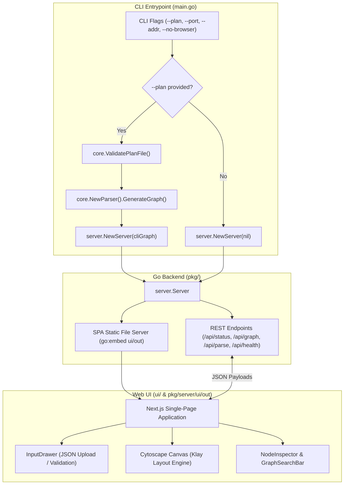
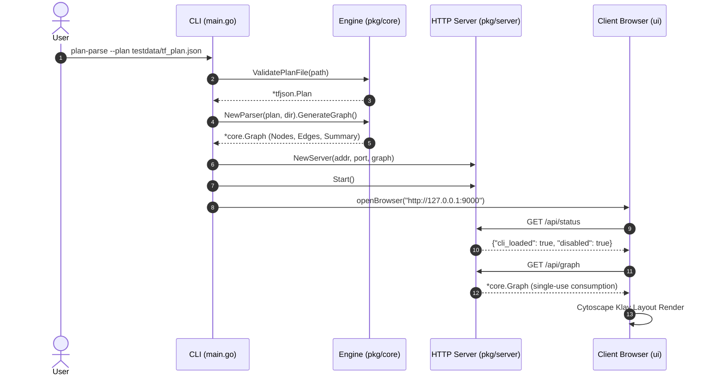
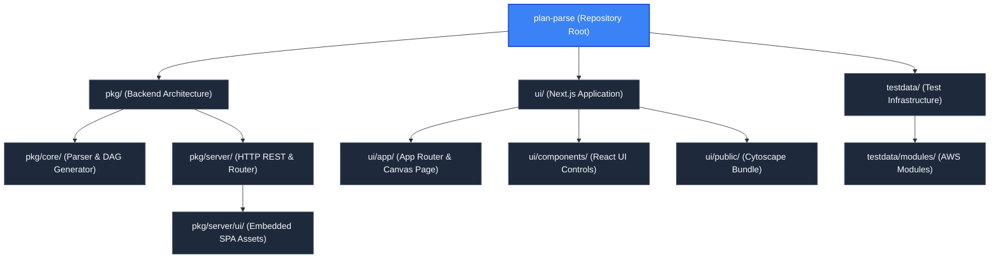

# Plan-Parse: Interactive Terraform Plan DAG Visualizer

`plan-parse` is a high-performance developer tool and web application designed to parse, analyze, and visually interact with Terraform execution plans. It transforms complex JSON plan exports into intuitive, hierarchical Cytoscape Directed Acyclic Graphs (DAGs), enabling platform engineers, SREs, and developers to audit planned infrastructure modifications, inspect resource blast radius, and trace cross-module dependency lineages before applying changes.

---

## System Architecture

The project is structured as a unified Go and Next.js hybrid application:
1. **Core Parser Engine (`pkg/core`)**: Validates Terraform plan schemas, resolves `.terraform/modules/modules.json` manifests, associates resources with source code locations, and builds a Cytoscape-compatible hierarchical graph model.
2. **Embedded HTTP Server (`pkg/server`)**: Serves a RESTful API for plan parsing and status checks while bundling and hosting the pre-compiled frontend distribution via Go's `embed.FS`.
3. **Interactive Frontend (`ui`)**: A Next.js 14 single-page application powered by React 18, Tailwind CSS, and Cytoscape.js with Klay hierarchical layout rendering.
4. **Mock Infrastructure Fixtures (`testdata`)**: A multi-tier AWS reference infrastructure setup containing 6 interrelated modules, root orchestration manifests, and a 66-resource plan fixture.



---

## Architecture & Internal Mechanics

### 1. CLI Execution Lifecycle
The CLI entry point is implemented in `main.go`. When invoked, the binary parses command-line flags:
- `-plan string`: Path to an exported Terraform plan JSON file.
- `-port int`: TCP port to bind the HTTP listener (default: `9000`).
- `-addr string`: Interface address to bind the listener (default: `127.0.0.1`).
- `-no-browser bool`: Suppresses automatic browser launch when set to `true`.

If `-plan` is specified:
1. The path is resolved to an absolute filesystem path.
2. `core.ValidatePlanFile` verifies file existence, enforces the `.json` extension, checks schema versions (`format_version` and `terraform_version`), and validates against HashiCorp's `terraform-json` structure.
3. `core.NewParser` scans the plan directory for `.terraform/modules/modules.json` to load source configuration mappings.
4. `parser.GenerateGraph()` produces a fully resolved Cytoscape DAG with action color gradients and summary statistics.
5. The pre-parsed graph is injected into `server.NewServer(addr, port, cliGraph)`.
6. A background goroutine waits 200ms for listener binding before spawning the system browser using OS-specific commands (`open` on macOS, `rundll32` on Windows, `xdg-open` on Linux).



### 2. Embedded Production Distribution
The Go server uses the `//go:embed all:ui/out` directive in `pkg/server/server.go` to package the static Next.js export directly into the compiled executable. This produces a zero-dependency standalone binary capable of running in CI/CD pipelines, remote bastion hosts, or local workstations.

---

## Key Files & Exports

| File | Type | Description |
| :--- | :--- | :--- |
| `main.go` | Go Source | Application entrypoint, CLI flag parsing, browser launcher, and server bootstrap. |
| `Makefile` | Build Automation | Orchestrates Next.js static compilation, asset copying, Go binary compilation, testing, and cleanup. |
| `go.mod` | Go Dependency | Declares Go module dependencies (`terraform-json`, `terraform-config-inspect`). |
| `go.sum` | Checksums | Cryptographic hashes of all direct and transitive Go dependencies. |
| `plan-parse` | Executable | Compiled Go binary packaging the HTTP backend and embedded static frontend. |

---

## Build & Usage

### Prerequisites
- Go 1.22+
- Node.js 18+ and pnpm

### Make Targets
```bash
# Build both frontend and Go binary
make all

# Build only Next.js frontend and copy artifacts to pkg/server/ui/out
make build-ui

# Compile the Go application binary
make build

# Run all backend unit and integration tests
make test

# Clean build artifacts
make clean
```

### Launching the Visualizer
```bash
# Launch with pre-loaded plan and automatic browser launch
./plan-parse --plan testdata/tf_plan.json

# Launch in headless server mode on custom port
./plan-parse --addr 0.0.0.0 --port 8080 --no-browser
```

---

## Hierarchy & Reference Graph

For more details about this section, check out [Go Backend & Server Packages](./pkg/README.md)
For more details about this section, check out [Next.js Web UI Application](./ui/README.md)
For more details about this section, check out [Test Fixtures and Sample Infrastructure](./testdata/README.md)


