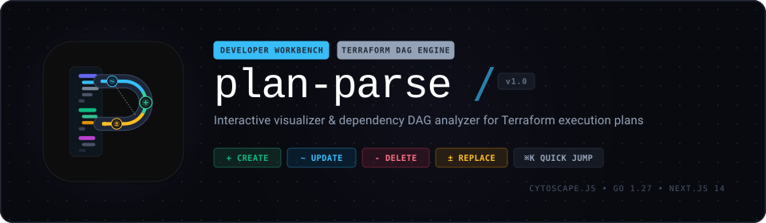
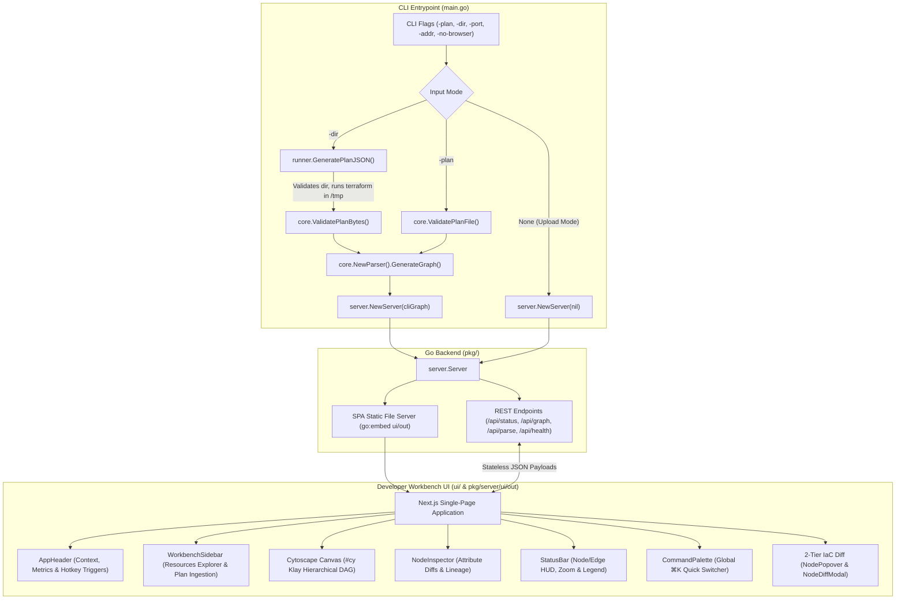
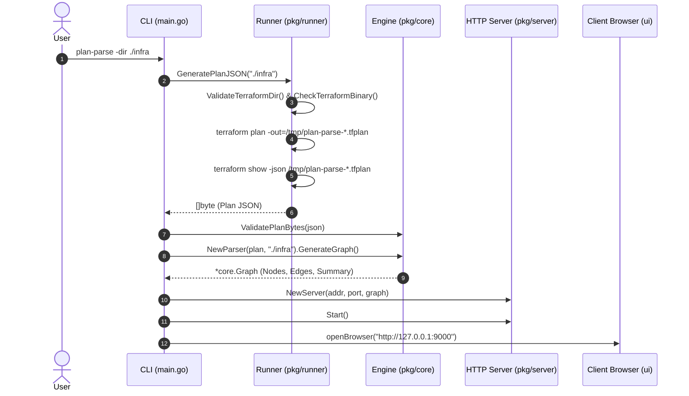
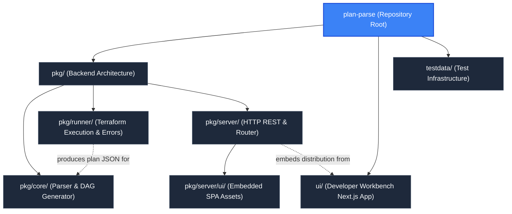

<p align="center">
  
</p>

# Plan-Parse: Interactive Terraform Plan DAG Visualizer

`plan-parse` is a high-performance developer tool and web application designed to parse, analyze, and visually interact with Terraform execution plans. It transforms complex JSON plan exports into intuitive, hierarchical Cytoscape Directed Acyclic Graphs (DAGs), enabling platform engineers, SREs, and developers to audit planned infrastructure modifications, inspect resource blast radius, and trace cross-module dependency lineages before applying changes.

---

## System Architecture

The project is structured as a unified Go backend and Next.js hybrid application:
1. **Core Parser Engine (`pkg/core`)**: Validates Terraform plan schemas, resolves `.terraform/modules/modules.json` manifests, associates resources with source code locations, and builds a Cytoscape-compatible hierarchical graph model.
2. **Programmatic Terraform Runner (`pkg/runner`)**: Validates Terraform directories, detects installed Terraform/OpenTofu CLI binaries, generates isolated temporary plans in `/tmp`, and categorizes operational failures into actionable diagnostic CLI errors.
3. **Embedded HTTP Server (`pkg/server`)**: Serves a RESTful API for plan parsing and status checks while bundling and hosting the pre-compiled frontend distribution via Go's `embed.FS`.
4. **Developer Workbench UI (`ui`)**: A Next.js 14 single-page application powered by React 18, Tailwind CSS, and Cytoscape.js featuring a grounded workbench layout (`AppHeader`, `WorkbenchSidebar`, `NodeInspector`, `StatusBar`, `CommandPalette`).
5. **Mock Infrastructure Fixtures (`testdata`)**: A multi-tier AWS reference infrastructure setup containing 6 interrelated modules, root orchestration manifests, and a 66-resource plan fixture.



---

## Architecture & Internal Mechanics

### 1. CLI Execution Lifecycle
The CLI entry point is implemented in `main.go`. When invoked, the binary parses command-line flags:
- `-plan string`: Path to an existing Terraform plan JSON file.
- `-dir string`: Path to a directory containing Terraform configuration files (`.tf` / `.tf.json`).
- `-port int`: TCP port to bind the HTTP listener (default: `9000`).
- `-addr string`: Interface address to bind the listener (default: `127.0.0.1`).
- `-no-browser bool`: Suppresses automatic browser launch when set to `true`.

> [!NOTE]
> The `-plan` and `-dir` flags are mutually exclusive. Specify either a pre-rendered JSON plan file or a Terraform configuration directory, or omit both to launch in browser-based upload mode.

#### Mode A: Plan File (`-plan`)
1. Resolves path to an absolute filesystem location.
2. `core.ValidatePlanFile` verifies file existence, enforces the `.json` extension, checks schema versions (`format_version` and `terraform_version`), and validates against HashiCorp's `terraform-json` structure.
3. `core.NewParser` scans the plan directory for `.terraform/modules/modules.json` to load source configuration mappings.
4. `parser.GenerateGraph()` produces a fully resolved Cytoscape DAG.

#### Mode B: Terraform Directory (`-dir`)
1. **Directory & Permissions Validation**:
   - Verifies the directory path exists, is a directory, and is accessible.
   - Verifies filesystem read and execute permissions on the directory.
   - Ensures the directory contains at least one `.tf` or `.tf.json` file.
   - Verifies each `.tf` / `.tf.json` file is readable.
2. **Binary Discovery**:
   - Searches `PATH` for `terraform` (or `tofu` fallback) via `runner.CheckTerraformBinary()` and tests executable availability (`terraform version`).
3. **Plan Generation (`runner.GeneratePlanJSON`)**:
   - Creates a temporary binary plan file in the system temp directory (`os.CreateTemp("", "plan-parse-*.tfplan")`). Writing to `/tmp` allows target directories to be mounted completely read-only (`:ro`).
   - Executes `terraform plan -input=false -no-color -out=<tempPlan>` within the target directory, passing along active environment variables with `TF_IN_AUTOMATION=1`.
   - Converts the plan to JSON via `terraform show -json <tempPlan>`.
   - Cleans up the temporary plan file upon completion via deferred removal.
4. **Schema Parsing & Graph Generation**:
   - Parses the JSON bytes with `core.ValidatePlanBytes`.
   - Initializes `core.NewParser` targeting the directory to load root and child module schemas.
   - Calls `parser.GenerateGraph()` to generate the DAG.



---

### 2. Diagnostic CLI Error Classification

When executing against a Terraform directory via `-dir`, errors from directory inspection, binary checks, or Terraform CLI execution are captured, classified, and formatted with visual distinction into human-readable diagnostic messages:

| Error Category | Detected Triggers | Actionable Hint |
| :--- | :--- | :--- |
| **`INITIALIZATION_REQUIRED`** | `Backend initialization required`, `run "terraform init"`, `Plugin reinitialization required`, `Module not installed`, `Could not load plugin` | Run `terraform init` in the configuration directory before generating a plan. |
| **`AUTHENTICATION`** | AWS (`NoCredentialProviders`, `ExpiredToken`, `AccessDenied`), GCP (`could not find default credentials`, `oauth2 token`), Azure (`az login`, `ARM_CLIENT_SECRET`), HTTP (`401`, `403`, `TFC_TOKEN`) | Check cloud credentials and environment variables (`AWS_PROFILE`, `AWS_ACCESS_KEY_ID`, `GOOGLE_APPLICATION_CREDENTIALS`, `ARM_*`). |
| **`VERSION_INCOMPATIBILITY`** | `Unsupported Terraform Core version`, `required_version`, `Incompatible provider version`, `version constraint` | Check installed Terraform/OpenTofu version against `required_version` constraints. |
| **`PERMISSION`** | `permission denied`, `EACCES`, `Access is denied`, `operation not permitted` | Check directory/file filesystem permissions or IAM role policies. |
| **`CONFIGURATION`** | Empty directory, missing `.tf` files, `No value for required variable`, `Reference to undeclared`, syntax errors | Provide required variables via `TF_VAR_*` or `terraform.tfvars`, and verify `.tf` syntax. |
| **`EXECUTION`** | Unclassified runtime failures, binary missing from `PATH` | Review Terraform output or verify Terraform CLI installation. |

Example diagnostic CLI output:
```text
================================================================================
[INITIALIZATION_REQUIRED ERROR] Terraform directory requires initialization
--------------------------------------------------------------------------------
Details: Error: Backend initialization required, please run "terraform init"
Hint:    Run 'terraform init' in the configuration directory before generating a plan.
================================================================================
```

---

### 3. Embedded Production Distribution
The Go server uses the `//go:embed all:ui/out` directive in `pkg/server/server.go` to package the static Next.js export directly into the compiled executable. This produces a zero-dependency standalone binary capable of running in CI/CD pipelines, remote bastion hosts, or local workstations without requiring Node.js.

---

## Stateless Architecture & Multi-Visualization Support

`plan-parse` is designed with a strictly decoupled, stateless execution model:

### 1. Pure Functional Ingestion (`POST /api/parse`)
- **Zero Server-Side State**: The ingestion endpoint validates plan bytes, constructs an ephemeral `core.NewParser`, generates the Cytoscape DAG, and streams JSON directly back to the client.
- **No Session Persistence**: No session state, files, database records, cookies, or caches are retained on the server.
- **Concurrent Ingestion**: Because `POST /api/parse` is completely thread-safe and reentrant, multiple ingestion requests execute simultaneously on separate Go goroutines without mutex locking or resource bottlenecks.

### 2. Multi-Tab Independence & Browser State Isolation
- **Client-Side State Containment**: Parsed graph structures reside exclusively in each browser tab's local React state (`useState(graphData)`).
- **Independent Canvas Sessions**: A single running `plan-parse` server instance can serve multiple browser tabs visualizing completely different plans simultaneously. Engineers can compare development, staging, and production plans side-by-side in separate tabs without collision or cross-talk.
- **Single-Use CLI Lifecycle Semantics**: When started with `-plan` or `-dir`, the server guards the pre-loaded plan with single-use flags (`statusServedOnce`, `graphServedOnce`). The initial tab receives the pre-loaded plan; subsequent tabs or page reloads automatically start fresh in the interactive workbench ready for new plan ingestion.

---

## Developer Workbench UI

The user interface delivers a docked engineering workbench styled with DM Sans, DM Mono, and a grounded dark theme palette (`#090a0f` background, `#0f121a` panels, `#232936` borders):

- **AppHeader**: Grounded top bar displaying active plan context, mode badges (`CLI Mode`), blast-radius micro-chips (+create, ~update, -delete, ±replace), `Cmd+K` palette trigger, canvas `Fit` / `1:1` zoom controls, and panel toggles.
- **WorkbenchSidebar**: Docked left sidebar with dual tabs:
  - *Resources Tab*: Hierarchical resource explorer with real-time text query and action filter pills (`all`, `create`, `update`, `delete`, `replace`, `no-op`, `read`), synchronized with canvas selections.
  - *Source Tab*: Drag-and-drop plan JSON ingestion with client-side preflight validation (<= 50MB, JSON syntax, non-empty `format_version` and `terraform_version`) and plan metadata card.
- **NodeInspector**: Docked right slide-over inspector displaying:
  - *Attribute Diff Tab*: Before/after syntax-highlighted diffs (`+ ADDED`, `- REMOVED`, `~ MODIFIED`, `= SAME`).
  - *Lineage Tab*: Upstream dependencies (`Depends On`) and downstream blast radius (`Referenced By`) with one-click navigation buttons.
  - *Raw JSON Tab*: Syntax-highlighted raw resource definition with address copying.
- **StatusBar**: Grounded bottom status strip showing live node and edge counts, zoom percentage HUD, viewport lock toggle, and integrated color-coded action legend.
- **CommandPalette**: Fast keyboard-first search modal triggered by `Cmd+K` / `Ctrl+K`.
- **2-Tier Progressive IaC Diff System**:
  - *Tier 1: On-Canvas Popover (`NodePopover`)*: Boundary-clamped quick-look card positioned adjacent to the selected node on the Cytoscape canvas. Displays resource action badges (`+ CREATE`, `~ UPDATE`, `- DELETE`, `± REPLACE`), module path, delta counters (`+N added`, `~N modified`, `-N removed`), `(forces replacement)` warnings, top 3 changed attributes preview, and shortcut triggers.
  - *Tier 2: Deep IaC Diff Modal (`NodeDiffModal`)*: High-density centered inspection dialog featuring:
    - **Unified HCL Diff**: CLI-style Terraform HCL output with sticky line gutters (`lineNum`, `symbol`) and syntax coloring for added, removed, and modified blocks.
    - **Side-by-Side (Split) HCL**: Dual-column state comparison between Current State (`before`) and Planned State (`after`).
    - **Attributes JSON Matrix**: Filterable tabular matrix with search query input, "Changed Only" toggle, before/after values, and replacement flags.
    - **Action Controls**: One-click "Copy Address" and "Copy Diff" utilities with affirmative visual feedback.

### Keyboard Shortcuts

| Shortcut | Action | Context / Scope |
| :--- | :--- | :--- |
| `[` | Toggle docked left sidebar | Global |
| `]` | Toggle docked right inspector | Global (when node is selected) |
| `Cmd+K` / `Ctrl+K` | Open / toggle Command Palette | Global |
| `d` / `D` | Open Tier 2 IaC Diff Modal | Global (when node is selected) |
| `Space` | Toggle Tier 1 On-Canvas Popover card | Canvas (when node is selected) |
| `Tab` | Cycle view modes (Unified $\rightarrow$ Split $\rightarrow$ Matrix) | Inside IaC Diff Modal |
| `c` / `C` | Toggle intermediate node collapse (Mutations Only) | Global |
| `t` / `T` | Toggle light / dark workbench theme | Global |
| `?` / `Shift + /` | Open keyboard shortcuts cheat sheet | Global |
| `f` / `F` | Fit all nodes to canvas viewport | Global |
| `+` / `=` | Smooth zoom in (factor 1.3) | Global |
| `-` | Smooth zoom out (factor 0.75) | Global |
| `0` | Reset zoom level to 100% (1:1) | Global |
| `Escape` | Dismiss modal/popover, deselect node, or clear canvas dimming | Global |

---

## Key Files & Exports

| File | Type | Description |
| :--- | :--- | :--- |
| `main.go` | Go Source | Application entrypoint, CLI flag parsing (`-dir`, `-plan`), browser launcher, and server bootstrap. |
| [`pkg/runner`](./pkg/runner/README.md) | Go Package | Directory validation, Terraform binary checks, plan generation, and error classification. |
| [`pkg/core`](./pkg/core/README.md) | Go Package | Schema validation, DAG generation, module parsing, and action summarization. |
| [`pkg/server`](./pkg/server/README.md) | Go Package | HTTP router, REST API handlers, CORS support, and embedded static asset distribution. |
| [`ui`](./ui/README.md) | Next.js App | Developer Workbench UI, App Router canvas orchestrator, and component library. |
| `Dockerfile` | Container Build | Multi-stage build packaging UI static export, static Go backend, and HashiCorp Terraform CLI. |
| `Makefile` | Build Automation | Orchestrates Next.js static compilation, asset copying, Go binary compilation, testing, and cleanup. |

---

## Build & Usage

### Prerequisites
- Go 1.27+ (matching `go.mod` 1.27.1)
- Node.js 20+ (Node.js 22 LTS recommended) and pnpm (v12.4+)
- Terraform CLI (v1.5+) or OpenTofu (v1.6+) in `PATH` (required for `-dir` execution)

### Make Targets
```bash
# Build both frontend and Go binary
make all

# Build only Next.js frontend and copy artifacts to pkg/server/ui/out
make build-ui

# Compile the Go application binary
make build

# Run all backend unit and integration tests
make test

# Clean build artifacts
make clean
```

### Launching the Visualizer

```bash
# Option 1: Execute against a local Terraform directory
./plan-parse -dir /path/to/terraform/project

# Option 2: Pre-load an existing plan JSON file
./plan-parse -plan testdata/tf_plan.json

# Option 3: Headless mode on custom port (suitable for remote servers & containers)
./plan-parse -dir /path/to/terraform/project -addr 0.0.0.0 -port 8080 -no-browser

# Option 4: Browser-based upload mode (no initial plan or directory)
./plan-parse -port 9000
```

---

## Running with Docker

`plan-parse` provides a production-grade multi-stage `Dockerfile` that packages the compiled binary, embedded UI, and HashiCorp Terraform CLI into a lightweight Alpine container running as a non-root user (`appuser:appgroup`).

### Docker Image Build
```bash
docker build -t plan-parse:latest .
```

### Docker Bind-Mount Execution
Run against any local Terraform project using a read-only Docker bind mount:

```bash
docker run --rm -it \
  -p 9000:9000 \
  -v /path/to/tf/project:/infra:ro \
  -e AWS_ACCESS_KEY_ID=$AWS_ACCESS_KEY_ID \
  -e AWS_SECRET_ACCESS_KEY=$AWS_SECRET_ACCESS_KEY \
  -e AWS_REGION=$AWS_REGION \
  plan-parse:latest -dir /infra -addr 0.0.0.0 -no-browser
```

### Why Read-Only (`:ro`) Works
When generating plans with `-dir`, `plan-parse` writes the temporary binary plan file to `/tmp` (outside the target configuration directory). Because no files are written to the target directory, mounting your project as read-only (`:ro`) ensures that source manifests and `.terraform` lockfiles remain completely untouched and protected.

### Passing Provider Credentials
When running inside Docker, provide cloud credentials to Terraform using either environment variables or credential directory volume mounts:

- **AWS**:
  - Environment variables: `-e AWS_ACCESS_KEY_ID -e AWS_SECRET_ACCESS_KEY -e AWS_SESSION_TOKEN -e AWS_REGION`
  - Mount credentials: `-v ~/.aws:/home/appuser/.aws:ro`
- **Google Cloud**:
  - Service account key: `-v /path/to/key.json:/app/key.json:ro -e GOOGLE_APPLICATION_CREDENTIALS=/app/key.json`
  - gcloud config: `-v ~/.config/gcloud:/home/appuser/.config/gcloud:ro`
- **Azure**:
  - Service principal: `-e ARM_CLIENT_ID -e ARM_CLIENT_SECRET -e ARM_SUBSCRIPTION_ID -e ARM_TENANT_ID`
  - Azure CLI tokens: `-v ~/.azure:/home/appuser/.azure:ro`

### Multi-Container Deployment & Dedicated Port Mapping
Because each container runs the standalone web server listening on internal port 9000, running multiple isolated containers mapped to different host ports enables dedicated visualizer endpoints for distinct plans, environments, or CI/CD pipelines:

```bash
# Container 1: Dedicated Staging visualizer on host port 9001
docker run -d --name plan-parse-staging \
  -p 9001:9000 \
  -v /path/to/staging/plan.json:/app/staging-plan.json:ro \
  plan-parse:latest -plan /app/staging-plan.json -addr 0.0.0.0 -no-browser

# Container 2: Dedicated Production visualizer on host port 9002
docker run -d --name plan-parse-production \
  -p 9002:9000 \
  -v /path/to/prod/plan.json:/app/prod-plan.json:ro \
  plan-parse:latest -plan /app/prod-plan.json -addr 0.0.0.0 -no-browser

# Container 3: Interactive workbench for ad-hoc uploads on host port 9000
docker run -d --name plan-parse-workbench \
  -p 9000:9000 \
  plan-parse:latest -addr 0.0.0.0 -no-browser
```

Each endpoint operates in total isolation, allowing teams to maintain persistent dashboards for multiple infrastructure stages while utilizing a single standardized container image.

---

## Hierarchy & Reference Graph

For more details about this section, check out:
- [Go Backend & Architecture (`pkg`)](./pkg/README.md)
- [Programmatic Runner (`pkg/runner`)](./pkg/runner/README.md)
- [Core Parser Engine (`pkg/core`)](./pkg/core/README.md)
- [HTTP Server Package (`pkg/server`)](./pkg/server/README.md)
- [Developer Workbench UI (`ui`)](./ui/README.md)
- [Test Fixtures and Sample Infrastructure (`testdata`)](./testdata/README.md)


