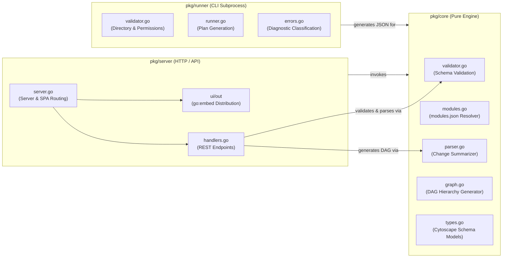
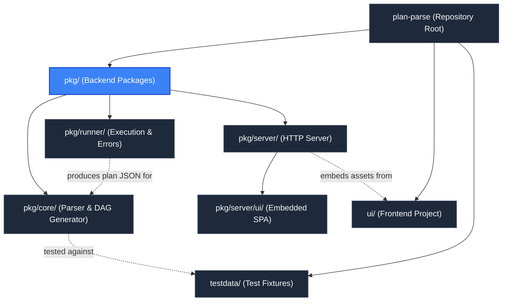

# Backend Packages (`pkg`)

> **Parent Documentation**: For the higher-level architecture, see [Repository Root](../README.md)

The `pkg` directory contains the complete Go backend implementation for `plan-parse`. It is divided into three distinct architectural layers:
1. **Core Domain (`pkg/core`)**: Pure domain logic responsible for Terraform plan schema validation, module inspection, reference resolution, and Cytoscape DAG construction.
2. **Programmatic Runner (`pkg/runner`)**: Execution engine responsible for directory validation, Terraform/OpenTofu CLI binary detection, isolated plan execution, and diagnostic error classification.
3. **Delivery & Transport (`pkg/server`)**: An HTTP server layer responsible for REST API routing, CORS handling, embedded static asset hosting, and session lifecycle management.

---

## Architectural Separation of Concerns

The backend follows clean architecture principles, keeping the core DAG transformation engine completely decoupled from both HTTP transport mechanics and CLI subprocess execution.

### 1. `pkg/core`
The `core` package does not depend on any HTTP or server constructs. It operates exclusively on Terraform plan structures defined by `github.com/hashicorp/terraform-json` and module metadata parsed by `github.com/hashicorp/terraform-config-inspect`. It takes raw plan JSON or file paths, parses resource dependencies and configurations, and generates a structured Cytoscape-compatible graph (`*core.Graph`).

### 2. `pkg/runner`
The `runner` package encapsulates interaction with the host environment and the Terraform CLI:
- Validates target directories, ensuring directory existence, readability, and presence of `.tf`/`.tf.json` files.
- Automatically discovers `terraform` or `tofu` binaries from `PATH`.
- Generates plans safely into `/tmp`, allowing target directories to remain read-only (`:ro`).
- Classifies CLI failures into actionable error categories (`AUTHENTICATION`, `VERSION_INCOMPATIBILITY`, `PERMISSION`, `INITIALIZATION_REQUIRED`, `CONFIGURATION`, `EXECUTION`) with human-readable CLI diagnostic banners.

### 3. `pkg/server`
The `server` package consumes `pkg/core` to fulfill web requests. It handles:
- Serving pre-parsed CLI plans or accepting on-the-fly file uploads via `POST /api/parse`.
- Single-use consumption semantics: safeguarding initial plan loads against page reloads or stale state.
- Embedded static asset delivery: serving pre-compiled HTML, JavaScript bundles, CSS, and Next.js static chunks directly from memory.

---

## Subpackages Overview

| Subpackage | Purpose | Primary Responsibilities |
| :--- | :--- | :--- |
| [`pkg/core`](./core/README.md) | Domain Parser & DAG Generator | Schema validation, modules manifest lookup, dependency resolution, Cytoscape node/edge generation, change action summaries. |
| `pkg/runner` | Programmatic Runner | Directory validation, binary discovery, plan extraction, and diagnostic error classification. |
| [`pkg/server`](./server/README.md) | HTTP Transport & Asset Hosting | REST routing (`/api/status`, `/api/graph`, `/api/parse`, `/api/health`), CORS middleware, SPA fallback routing, embedded static files. |
| [`pkg/server/ui`](./server/ui/README.md) | Embedded Static Web Artifacts | Directory holding pre-compiled production output (`ui/out`) for Go embedding via `//go:embed all:ui/out`. |

---

## Hierarchy & Reference Graph

