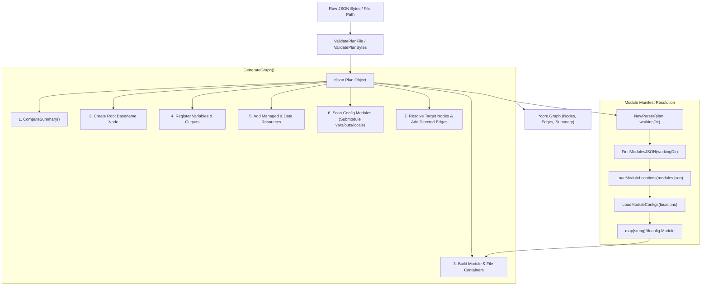
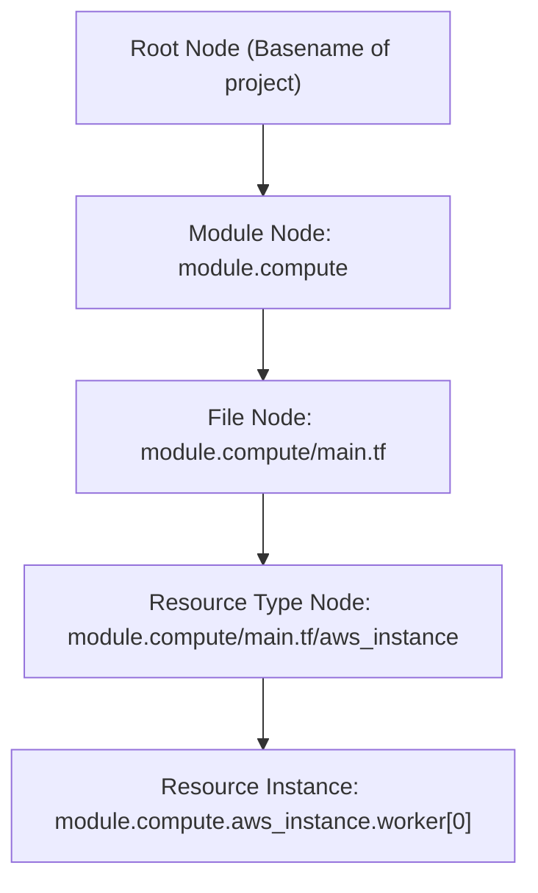
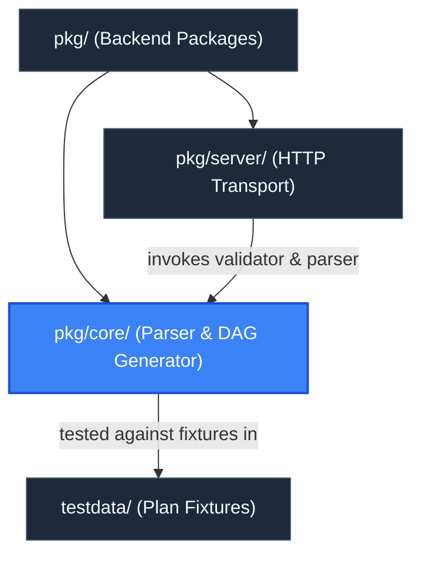

# Core Engine Package (`pkg/core`)

> **Parent Documentation**: For the higher-level architecture, see [Backend Packages](../README.md)

The `pkg/core` package provides the domain logic of `plan-parse`. It is responsible for validating Terraform execution plan JSON payloads, discovering and inspecting Terraform configuration files across local modules, resolving references and dependency edges, calculating plan change summaries, and assembling a hierarchical Cytoscape Directed Acyclic Graph (DAG).

---

## Architectural Workflow

The DAG generation lifecycle transforms raw Terraform plan JSON and disk configuration into a typed graph structure ready for frontend canvas rendering.



---

## Internal Mechanics & Key Subsystems

### 1. Plan Schema Validation (`validator.go`)
Before parsing, plan inputs undergo strict pre-flight validation:
- **`ValidatePlanFile(filePath string)`**: Verifies that the path exists, is not a directory, ends with the `.json` extension, and reads the raw file bytes before delegating to `ValidatePlanBytes`.
- **`ValidatePlanBytes(data []byte)`**: Checks that the JSON payload contains non-empty `format_version` and `terraform_version` fields, deserializes the content into HashiCorp's `tfjson.Plan`, and executes `plan.Validate()`.

### 2. Module Discovery & File Mapping (`modules.go`, `parser.go`)
Terraform plans record resource changes with addresses like `module.compute.aws_instance.worker[0]`, but the plan itself does not store the exact `.tf` filename or line number. `pkg/core` recovers this source context:
- **`FindModulesJSON(startPath string)`**: Walks upward up to 5 directory levels searching for `.terraform/modules/modules.json`.
- **`LoadModuleLocations(manifestPath, baseDir)`**: Parses the manifest and resolves relative paths to absolute directories for each module key.
- **`LoadModuleConfigs(locations, baseDir)`**: Uses `tfconfig.LoadModule` to load AST metadata for each module.
- **`FindResourceFile(moduleAddr, mode, resType, resName)`**: Looks up the resource within `tfconfig.Module.ManagedResources` or `DataResources` to return the source file basename (e.g. `main.tf`) and source line number.

### 3. Compound Node Hierarchy (`graph.go`)
Cytoscape supports compound (nested) nodes. `pkg/core` constructs a 5-tier parent-child hierarchy to organize resources intuitively:



### 4. Dependency & Edge Resolution (`graph.go`)
Edges represent directional dependencies (`source -> target`, meaning `source` depends on `target`).
- **Two-Pass Configuration Scanning**:
  1. `scanConfigModule`: Traverses root and child modules to detect referenced variables, outputs, `local.*` definitions, and `terraform.workspace` tokens, dynamically creating corresponding graph nodes.
  2. `traverseConfigModule`: Evaluates resource `expressions` and explicit `depends_on` blocks.
- **Reference Resolution (`resolveTarget`)**:
  - Resolves local scoped references (`module.child.var.subnet_id` or `local.tags`).
  - Converts module outputs (`module.networking.public_subnet_ids` $\to$ `module.networking.output.public_subnet_ids`).
  - Strips attribute accessors (`aws_instance.worker.id` $\to$ `aws_instance.worker`).
  - Removes index suffixes (`public_subnets[0]` $\to$ `public_subnets`).
- **Gradient Color Mapping**:
  Each edge computes a CSS linear gradient from the source node action/type color to the target node action/type color:
  ```go
  edgeMap[edgeID] = Edge{
      Data: EdgeData{
          ID:       edgeID,
          Source:   src,
          Target:   tgt,
          Gradient: fmt.Sprintf("%s %s", srcColor, tgtColor),
      },
      Classes: "edge",
  }
  ```

---

## Key Files & Exports

| File | Primary Exports | Description |
| :--- | :--- | :--- |
| `types.go` | `Action`, `ResourceType`, `Node`, `NodeData`, `Edge`, `EdgeData`, `Graph`, `PlanSummary`, `GetActionColor`, `GetResourceTypeColor` | Data structures defining Cytoscape graph payloads, color palettes, and summary statistics. |
| `validator.go` | `ValidatePlanFile`, `ValidatePlanBytes` | Strict schema and version validation for Terraform plan JSON. |
| `modules.go` | `ModuleLocation`, `ModuleManifest`, `FindModulesJSON`, `LoadModuleLocations`, `LoadModuleConfigs` | Traversal and loading of `.terraform/modules/modules.json` and module ASTs. |
| `parser.go` | `Parser`, `NewParser`, `NewParserWithConfigs`, `ComputeSummary`, `GetChangeAction`, `FindResourceFile` | Parser state holder, change action evaluation, and AST resource lookup. |
| `graph.go` | `GenerateGraph` | Main DAG generation algorithm, hierarchy builder, and edge resolution engine. |
| `core_test.go` | Unit & Integration Tests | Test suite validating plan validation, synthetic actions, module loading, and edge wiring. |

---

## Action and Resource Types

| Type / Action | Constant | Display Color | Purpose |
| :--- | :--- | :--- | :--- |
| **create** | `ActionCreate` | `#22c55e` (Green) | Resources being newly created in the plan. |
| **update** | `ActionUpdate` | `#3b82f6` (Blue) | In-place attribute modifications. |
| **delete** | `ActionDelete` | `#ef4444` (Red) | Resources slated for destruction. |
| **replace** | `ActionReplace` | `#f59e0b` (Amber) | Resources destroyed and re-created (compound actions). |
| **no-op** | `ActionNoop` | `#64748b` (Slate) | Unchanged resources in the plan. |
| **read** | `ActionRead` | `#ec4899` (Pink) | Data sources read during plan phase. |
| **module** | `ResourceTypeModule` | `#a855f7` (Purple) | Module container nodes. |
| **variable** | `ResourceTypeVariable` | `#0ea5e9` (Sky) | Terraform input variables. |
| **output** | `ResourceTypeOutput` | `#eab308` (Yellow) | Terraform output values. |
| **locals** | `ResourceTypeLocal` | `#000000` (Black/Dark Slate) | Synthetic local and workspace nodes. |

---

## Hierarchy & Reference Graph

This section connects to [HTTP Server Package](../server/README.md) for delivering parsed graphs over REST endpoints, and [Testdata Fixtures](../../testdata/README.md) for plan inputs.


