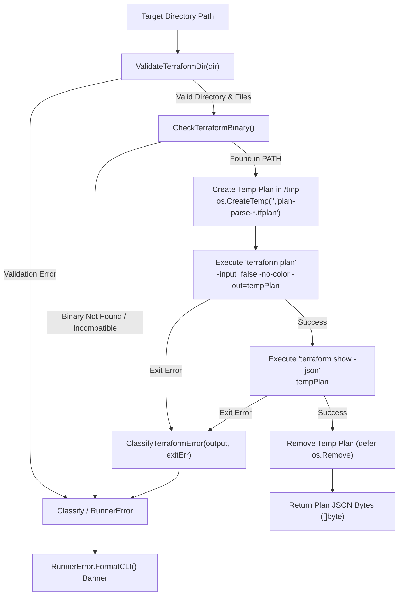
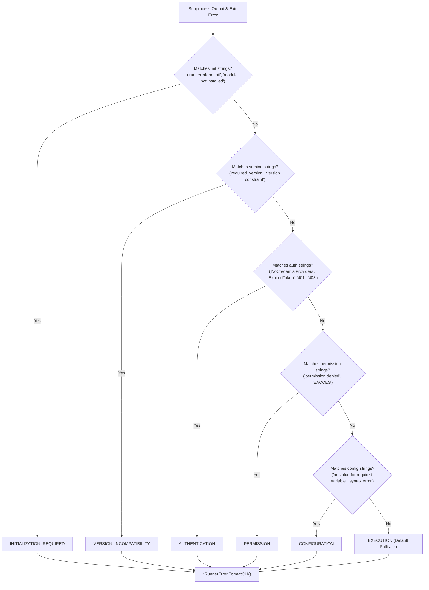
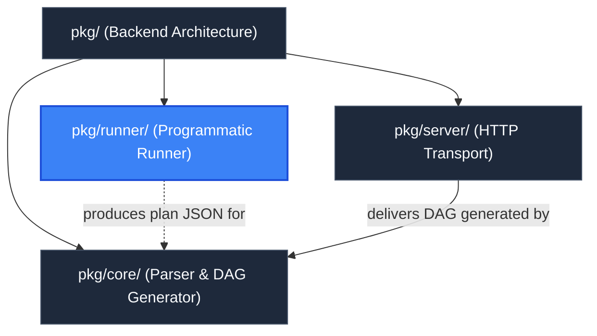

# Programmatic Terraform Runner Package (`pkg/runner`)

> **Parent Documentation**: For the higher-level backend architecture, see [Backend Packages](../README.md)

The `pkg/runner` package provides programmatic execution and directory validation for Terraform and OpenTofu infrastructure projects. It is responsible for pre-flight directory and permission validation, discovering executable binaries in the system `PATH`, orchestrating isolated plan generation in temporary files, and providing a rule-based diagnostic CLI error classification engine that categorizes failures with actionable remediation guidance.

---

## Architectural Workflow

The runner encapsulates the complete subprocess lifecycle when `plan-parse` is invoked against an infrastructure directory (`-dir <path>`). It isolates plan generation to keep target directories immutable and read-only.



---

## Internal Mechanics & Key Subsystems

### 1. Pre-Flight Directory & Permissions Validation (`validator.go`)
Before attempting to spawn any subprocesses, `ValidateTerraformDir(dir string)` carries out rigorous pre-flight checks:
- **Path Resolution**: Verifies that the path string is non-empty and resolves it to an absolute path via `filepath.Abs`.
- **Filesystem Access & Stat**: Checks that the directory exists and is a directory (rejecting file paths). Catches `os.IsNotExist` and `os.IsPermission` errors.
- **Directory Traversal**: Reads directory entries via `os.ReadDir`. Detects and reports directory read/execute permission denials.
- **Configuration Discovery**: Scans entries for files ending with `.tf` or `.tf.json` (case-insensitive). If no configuration files are found, it raises a `CONFIGURATION` error.
- **File Readability**: Attempts to open every detected configuration file with `os.Open` to verify that the active user process holds read permissions on each individual file.

### 2. Binary Discovery & OpenTofu Fallback (`runner.go`)
`CheckTerraformBinary()` discovers and validates the CLI executable:
1. Searches system `PATH` for `terraform` using `exec.LookPath`.
2. If `terraform` is not found, it falls back to checking for OpenTofu (`tofu`).
3. If neither binary exists, it returns a structured `RunnerError` with category `EXECUTION` and installation links.
4. Executes `<bin> version` to verify that the binary has execution permissions and is compatible with the host architecture.

### 3. Isolated `/tmp` Plan Generation & Read-Only Protection (`runner.go`)
To support containerized and security-conscious environments where infrastructure directories are mounted as read-only (`:ro`), `pkg/runner` ensures that no artifacts are ever written inside the target directory:
- **Temporary Binary Plan**: Generates an isolated temporary plan file in the OS temp directory (`os.CreateTemp("", "plan-parse-*.tfplan")`).
- **Environment Automation**: Injects `TF_IN_AUTOMATION=1` into the subprocess execution environment to suppress interactive prompts and color codes.
- **Plan Generation**:
  ```go
  planCmd := exec.CommandContext(ctx, binPath, "plan", "-input=false", "-no-color", "-out="+tempPlanPath)
  planCmd.Dir = absDir
  ```
- **JSON Conversion**:
  ```go
  showCmd := exec.CommandContext(ctx, binPath, "show", "-json", tempPlanPath)
  showCmd.Dir = absDir
  ```
- **Deterministic Cleanup**: Uses `defer os.Remove(tempPlanPath)` to ensure that temporary files are deleted immediately after reading JSON data, even if plan parsing fails.

### 4. Context Cancellation & Timeout Support (`runner.go`)
- `GeneratePlanJSON(dir string)` delegates directly to `GeneratePlanJSONContext(context.Background(), dir)`.
- `GeneratePlanJSONContext(ctx, dir)` accepts a standard Go `context.Context` to support execution timeouts and clean signal handling (e.g. terminating subprocesses if `SIGINT` or `SIGTERM` is received).

### 5. Diagnostic Error Classification Engine (`errors.go`)
When Terraform execution fails, raw CLI error outputs are parsed by `ClassifyTerraformError(output string, exitErr error)`. The engine inspects error strings against pattern rules and returns a structured `*RunnerError` categorized under one of 6 distinct domains:

| Category | Detected Patterns / Root Causes | Actionable Remediation Hint |
| :--- | :--- | :--- |
| **`INITIALIZATION_REQUIRED`** | `Backend initialization required`, `run "terraform init"`, `run 'terraform init'`, `run "tofu init"`, `Plugin reinitialization required`, `Module not installed`, `Could not load plugin` | Run `terraform init` in the configuration directory before generating a plan. |
| **`AUTHENTICATION`** | AWS (`NoCredentialProviders`, `ExpiredToken`, `AccessDenied`, `SignatureDoesNotMatch`, `UnauthorizedOperation`, `InvalidClientTokenId`), GCP (`could not find default credentials`, `oauth2 token`, `compute/metadata`), Azure (`az login`, `ARM_CLIENT_SECRET`, `AuthenticationFailed`), TFC/HTTP (`401 unauthorized`, `403 forbidden`, `tfc_token`, `invalid authentication token`, `bearer token`) | Check your cloud credentials and environment variables (e.g. `AWS_PROFILE`, `AWS_ACCESS_KEY_ID`, `GOOGLE_APPLICATION_CREDENTIALS`, `ARM_CLIENT_ID`, `ARM_CLIENT_SECRET`). |
| **`VERSION_INCOMPATIBILITY`** | `Unsupported Terraform Core version`, `this configuration requires terraform version`, `required_version`, `Incompatible provider version`, `version constraint` | Verify your installed Terraform/OpenTofu version against `required_version` constraints and provider version requirements in your configuration. |
| **`PERMISSION`** | `permission denied`, `eacces`, `access is denied`, `operation not permitted` | Check directory and file filesystem permissions or verify IAM role permissions. |
| **`CONFIGURATION`** | Empty directory, missing `.tf` files, `No value for required variable`, `Reference to undeclared`, `syntax error`, `missing required argument`, `unsupported argument`, `unsupported block type` | Ensure all required variables are set via environment variables (`TF_VAR_*`), `terraform.tfvars`, or CLI flags, and verify configuration syntax. |
| **`EXECUTION`** | Subprocess launch errors, exit failures without specific classified strings, missing binary in `PATH` | Review the Terraform output above for detailed diagnostic messages. |

### 6. Visual CLI Error Formatting (`FormatCLI`)
`RunnerError` implements `FormatCLI()`, generating high-visibility terminal banners:

```text
================================================================================
[INITIALIZATION_REQUIRED ERROR] Terraform directory requires initialization
--------------------------------------------------------------------------------
Details: Error: Backend initialization required, please run "terraform init"
Hint:    Run 'terraform init' in the configuration directory before generating a plan.
================================================================================
```

---

## Key Files & Exports

| File | Primary Exports | Description |
| :--- | :--- | :--- |
| `runner.go` | `CheckTerraformBinary`, `GeneratePlanJSON`, `GeneratePlanJSONContext` | Terraform/OpenTofu binary detection, isolated `/tmp` plan orchestration, JSON stream extraction. |
| `validator.go` | `ValidateTerraformDir` | Strict directory pre-flight inspection (existence, permissions, configuration file presence, readability). |
| `errors.go` | `ErrorCategory`, `RunnerError`, `ClassifyTerraformError`, Category Constants | Structured error models, pattern classification rules, and CLI banner formatter. |
| `runner_test.go` | Unit & Integration Tests | Test coverage for binary checks, directory validation permutations, error classification strings, and formatting. |

---

## Error Classification Workflow



---

## Hierarchy & Reference Graph

This package produces plan JSON payloads that feed directly into [Core Engine Package](../core/README.md) and connects with [HTTP Server Package](../server/README.md) through the main CLI coordinator.


