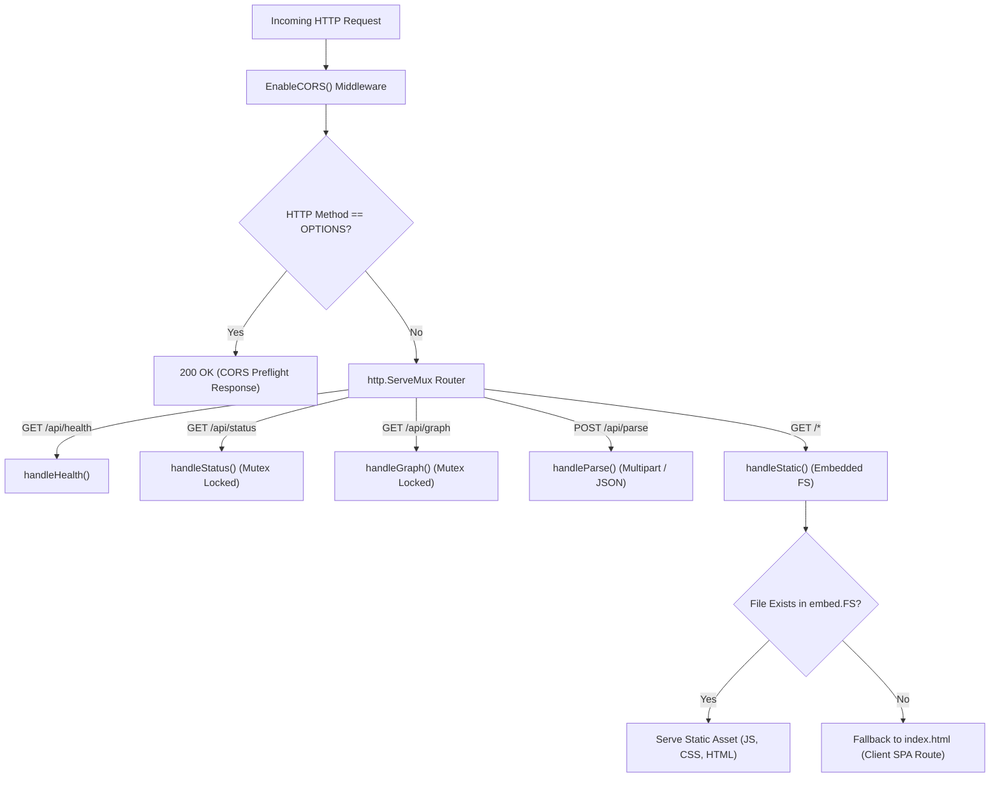
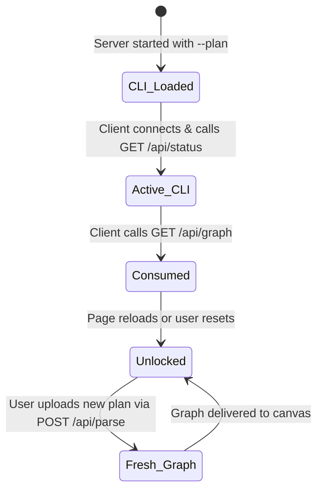
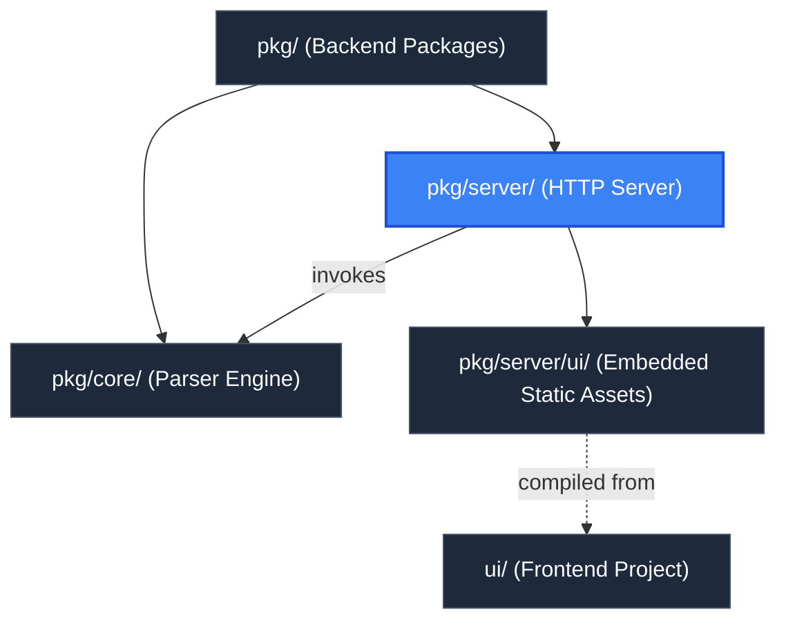

# Server Package (`pkg/server`)

> **Parent Documentation**: For the higher-level architecture, see [Backend Packages](../README.md)

The `pkg/server` package implements the HTTP transport layer for `plan-parse`. It couples an embedded static web server with a high-performance RESTful API. It hosts the single-page application (SPA), facilitates client-side plan uploads, enforces Cross-Origin Resource Sharing (CORS) rules, and manages CLI-injected graph state lifecycle semantics.

---

## Architecture & Request Routing

Incoming HTTP requests are routed through custom CORS middleware before entering an internal `http.ServeMux` router.



---

## Internal Mechanics & Key Subsystems

### 1. Embedded Static Distribution (`server.go`)
The frontend production build is embedded into the compiled binary via Go's `embed` package:
```go
//go:embed all:ui/out
var defaultUIFS embed.FS
```
In `NewServer()`, `fs.Sub(defaultUIFS, "ui/out")` isolates the distribution subtree. During request dispatch, `handleStatic` attempts to open the requested relative path. If the path does not correspond to a static physical file, the server returns `index.html` with status `200 OK`, allowing the Next.js client-side router to handle deep navigation paths without 404 errors.

### 2. Single-Use CLI Lifecycle Semantics (`handlers.go`)
When a user launches `plan-parse` with the `--plan` CLI argument, the CLI graph is loaded into memory:
1. **First Load**:
   - `GET /api/status` returns `{"cli_loaded": true, "disabled": true}`, informing the frontend that a CLI-supplied plan is present and locking file upload inputs.
   - `GET /api/graph` delivers the pre-parsed `*core.Graph` payload.
2. **Consumption & Reset**:
   - State variables `statusServedOnce` and `graphServedOnce` are protected by `sync.Mutex` (`s.mu`).
   - Once served, the session transitions into unlocked mode.
3. **Subsequent Reloads**:
   - `GET /api/status` returns `{"cli_loaded": false, "disabled": false}`.
   - `GET /api/graph` returns an empty graph (`{nodes: [], edges: []}`).
   - The UI automatically opens the `InputDrawer` so the user can drag-and-drop or upload a new plan file.



### 3. Dynamic Plan Upload Endpoint (`POST /api/parse`)
`handleParse` processes plan files on-the-fly without saving session state to disk:
- **Payload Flexibility**: Accepts either `multipart/form-data` (form fields `file` or `plan`) or raw JSON bodies (`application/json`).
- **Safety Limits**: Limits body reading to 50MB (`io.LimitReader(r.Body, 50<<20)`).
- **Validation & DAG Build**:
  1. Validates schema and versions with `core.ValidatePlanBytes`.
  2. Constructs a new parser: `core.NewParser(plan, ".")`.
  3. Executes `parser.GenerateGraph()`.
  4. Serializes the generated graph JSON directly to the response writer.

---

## Key Files & Exports

| File | Primary Exports | Description |
| :--- | :--- | :--- |
| `server.go` | `Server`, `NewServer`, `EnableCORS`, `ServeHTTP`, `Start`, `Close`, `Listener` | Core HTTP server struct, CORS configuration, embed.FS mounting, and TCP socket lifecycle. |
| `handlers.go` | `StatusResponse`, `HealthResponse`, `ErrorResponse`, `handleHealth`, `handleStatus`, `handleGraph`, `handleParse` | HTTP handler methods for REST API endpoints and state lifecycle management. |
| `server_test.go` | Comprehensive Test Suite | Integration tests verifying CORS, OPTIONS, single-use CLI lifecycle, raw and multipart uploads, and SPA fallback. |

---

## API Reference

### `GET /api/health`
Returns the operational health of the server process.
```json
{
  "alive": true
}
```

### `GET /api/status`
Returns whether a CLI plan is active for initial display.
```json
{
  "cli_loaded": true,
  "disabled": true
}
```

### `GET /api/graph`
Returns the Cytoscape graph payload. On initial CLI load, returns the populated graph; on subsequent calls, returns an empty graph.

### `POST /api/parse`
Parses an uploaded Terraform plan and returns the DAG.
- **Headers**: `Content-Type: multipart/form-data` OR `Content-Type: application/json`
- **Response**: `200 OK` with JSON graph representation or `400 Bad Request` with error details:
```json
{
  "error": "invalid terraform plan: missing or empty format_version"
}
```

---

## Hierarchy & Reference Graph

For more details about this section, check out [Embedded UI Assets](./ui/README.md)

This section connects to [Core Parser Engine](../core/README.md) for DAG generation, and [Frontend Application](../../ui/README.md) for user interface assets.


