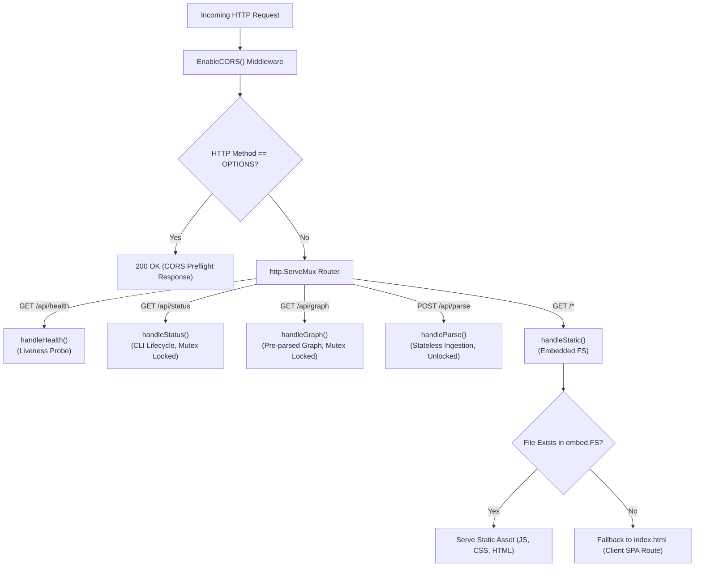
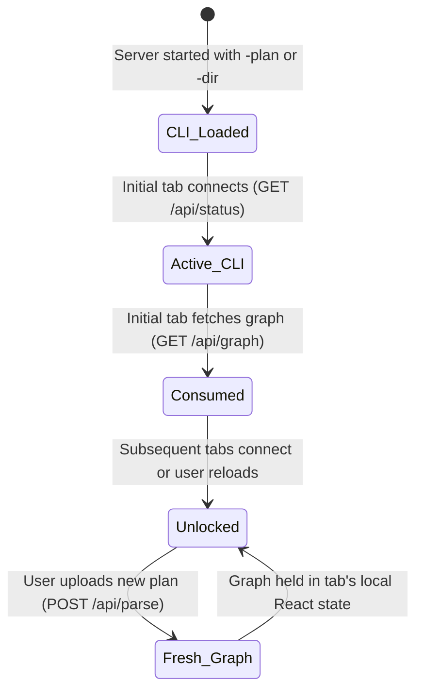
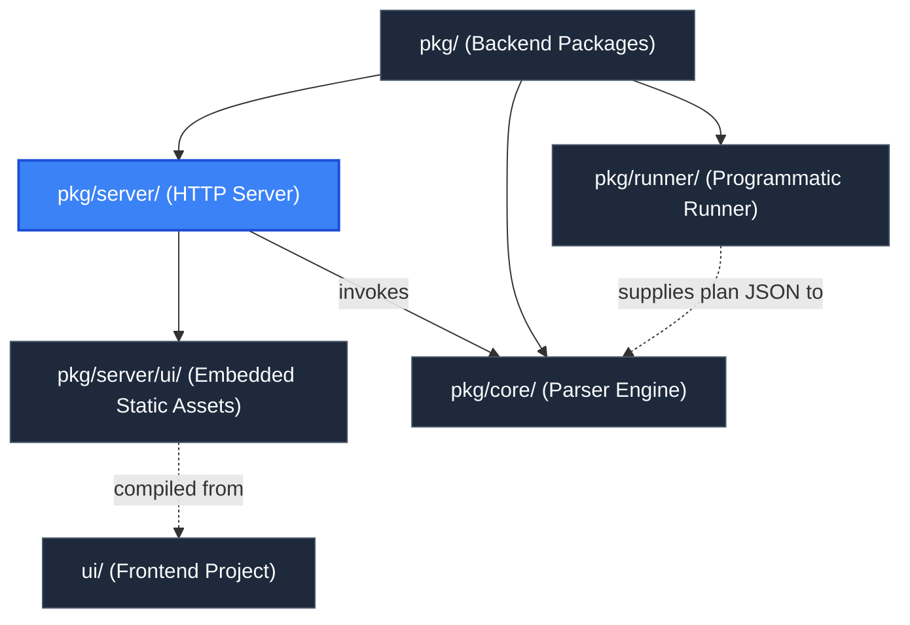

# Server Package (`pkg/server`)

> **Parent Documentation**: For the higher-level backend architecture, see [Backend Packages](../README.md)

The `pkg/server` package implements the HTTP transport layer for `plan-parse`. It couples an embedded static web server with a high-performance RESTful API. It hosts the single-page application (SPA), facilitates client-side plan uploads, enforces Cross-Origin Resource Sharing (CORS) rules, and manages CLI-injected graph state lifecycle semantics.

---

## Architecture & Request Routing

Incoming HTTP requests pass through custom CORS middleware before entering Go's `http.ServeMux` router using method-based route matching:

```go
s.router.HandleFunc("GET /api/health", s.handleHealth)
s.router.HandleFunc("GET /api/status", s.handleStatus)
s.router.HandleFunc("GET /api/graph", s.handleGraph)
s.router.HandleFunc("POST /api/parse", s.handleParse)
s.router.HandleFunc("/", s.handleStatic)
```



---

## Internal Mechanics & Key Subsystems

### 1. Embedded Static Distribution (`server.go`)
The frontend production build is embedded directly into the compiled binary via Go's `embed` package:

```go
//go:embed all:ui/out
var defaultUIFS embed.FS
```

In `NewServer()`, `fs.Sub(defaultUIFS, "ui/out")` isolates the distribution subtree. During request dispatch, `handleStatic` attempts to open the requested relative path. If the path does not correspond to a static physical file, the server returns `index.html` with status `200 OK`, allowing the Next.js client-side router to handle deep navigation paths without 404 errors.

### 2. Single-Use CLI Lifecycle Semantics (`handlers.go`)
When a user launches `plan-parse` with the `--plan` or `--dir` CLI argument, the CLI graph is loaded into memory:
1. **First Load**:
   - `GET /api/status` returns `{"cli_loaded": true, "disabled": true}`, informing the frontend that a CLI-supplied plan is present and locking file upload inputs.
   - `GET /api/graph` delivers the pre-parsed `*core.Graph` payload.
2. **Consumption & Reset**:
   - State variables `statusServedOnce` and `graphServedOnce` are protected by `sync.Mutex` (`s.mu`).
   - Once served, the session transitions into unlocked mode.
3. **Subsequent Reloads**:
   - `GET /api/status` returns `{"cli_loaded": false, "disabled": false}`.
   - `GET /api/graph` returns an empty graph (`{nodes: [], edges: []}`).
   - The UI automatically opens the `WorkbenchSidebar` source tab so the user can drag-and-drop or upload a new plan file.



### 3. Dynamic Stateless Plan Ingestion (`POST /api/parse`)
`handleParse` processes plan files on-the-fly without saving session state to disk:
- **Payload Flexibility**: Accepts either `multipart/form-data` (form fields `file` or `plan`) or raw JSON bodies (`application/json`).
- **Safety Limits**: Limits body reading to 50MB (`io.LimitReader(r.Body, 50<<20)`).
- **Validation & DAG Build**:
  1. Validates schema and versions with `core.ValidatePlanBytes`.
  2. Constructs a new parser: `core.NewParser(plan, ".")`.
  3. Executes `parser.GenerateGraph()`.
  4. Serializes the generated `*core.Graph` JSON payload directly to the response writer, containing nodes (with `changeDetails` attribute diffs), directed edges, and `PlanSummary` metric counters that populate the frontend's Resource Explorer, inspector panels, and action distribution bar.

### 4. Stateless Design, In-Memory Concurrency & Multi-Tab Isolation
The server architecture is explicitly engineered for stateless, high-concurrency operation:
- **Zero Server-Side State**: The `POST /api/parse` endpoint is completely pure and functional. It reads plan bytes, constructs an ephemeral DAG in memory, writes the JSON response, and retains zero references. No database, session cache, local files, or session cookies are used.
- **Goroutine Concurrency Model**: Go's `net/http` server dispatches every incoming HTTP connection into its own independent goroutine. Because `POST /api/parse` does not acquire the CLI mutex (`s.mu`), concurrent plan upload requests execute entirely in parallel without lock contention.
- **Multi-Tab Independence**: Parsed DAG state lives strictly in the browser tab's local React state (`useState(graphData)`). Opening `plan-parse` in multiple browser tabs allows users to visualize completely different plans simultaneously against a single running backend instance without collision or cross-talk.
- **CLI Pre-Load Handshake**: When launched via CLI flags (`-plan` or `-dir`), the pre-loaded plan is delivered once to the first tab via single-use lifecycle flags (`statusServedOnce`, `graphServedOnce`). Any additional tabs opened thereafter or subsequent page reloads start clean in the interactive workbench, ready for independent plan uploads.

### 5. Containerization & Multi-Container Deployment Mechanics
`plan-parse` is packaged as a standalone multi-stage Docker image featuring the Go backend, embedded UI, and HashiCorp Terraform CLI:
- **Container Defaults**: The container entrypoint executes `/app/plan-parse` with default flags `-addr 0.0.0.0 -port 9000 -no-browser`.
- **Single Container Multi-Tenancy**: Because `POST /api/parse` is stateless, a single running container can serve multiple concurrent users and browser tabs.
- **Multi-Container Port Mapping**: For teams managing multiple environments or running parallel CI/CD visualizer instances, multiple containers can be launched with distinct host port mappings:
  - Container 1 (Staging): `-p 9001:9000` with `-plan /staging/plan.json`
  - Container 2 (Production): `-p 9002:9000` with `-plan /prod/plan.json`
  - Container 3 (Interactive Ingest): `-p 9000:9000` without pre-loaded plans
- **Read-Only (`:ro`) Volume Mounting**: Infrastructure directories mounted into containers can safely use `:ro` flags because temporary plan files during `-dir` execution are created strictly under `/tmp`, leaving host directories immutable.

---

## Key Files & Exports

| File | Primary Exports | Description |
| :--- | :--- | :--- |
| `server.go` | `Server`, `NewServer`, `EnableCORS`, `ServeHTTP`, `Start`, `Close`, `Listener` | Core HTTP server struct, CORS configuration, embed.FS mounting, and TCP socket lifecycle. |
| `handlers.go` | `StatusResponse`, `HealthResponse`, `ErrorResponse`, `handleHealth`, `handleStatus`, `handleGraph`, `handleParse` | HTTP handler methods for REST API endpoints and state lifecycle management. |
| `server_test.go` | Comprehensive Test Suite | Integration tests verifying CORS, OPTIONS, single-use CLI lifecycle, raw and multipart uploads, and SPA fallback. |

---

## API Reference

### `GET /api/health`
Returns the operational health of the server process.
```json
{
  "alive": true
}
```

### `GET /api/status`
Returns whether a CLI plan is active for initial display.
```json
{
  "cli_loaded": true,
  "disabled": true
}
```

### `GET /api/graph`
Returns the Cytoscape graph payload. On initial CLI load, returns the populated graph; on subsequent calls, returns an empty graph (`{nodes: [], edges: []}`).

### `POST /api/parse`
Parses an uploaded Terraform plan and returns the DAG.
- **Headers**: `Content-Type: multipart/form-data` OR `Content-Type: application/json`
- **Response**: `200 OK` with JSON graph representation or `400 Bad Request` with error details:
```json
{
  "error": "invalid terraform plan: missing or empty format_version"
}
```

---

## Hierarchy & Reference Graph

For more details about static files, check out [Embedded UI Assets](./ui/README.md).
This package connects to [Core Parser Engine](../core/README.md) for DAG generation, [Programmatic Runner](../runner/README.md) for directory plan extraction, and [Frontend Application](../../ui/README.md) for user interface assets.


