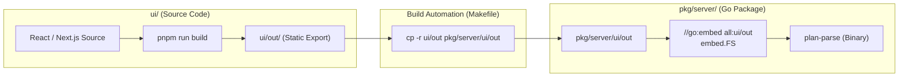
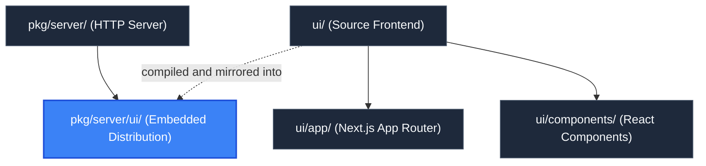

# Embedded UI Distribution (`pkg/server/ui`)

> **Parent Documentation**: For the higher-level architecture, see [Server Package](../README.md)

The `pkg/server/ui` directory houses the production-compiled frontend assets embedded directly into the Go binary during build time. It bridges the Next.js React frontend with the Go runtime, enabling zero-dependency single-binary distribution of the entire application.

---

## Architectural Role & Embedding Constraints

In Go, the `//go:embed` compiler directive has a strict security constraint: **it cannot traverse parent directories (`..`) or reference paths outside the enclosing package directory**.

Because the source frontend project lives at the repository root (`ui/`), the Next.js static HTML export (`ui/out`) must be mirrored into the server package namespace (`pkg/server/ui/out`) before invoking `go build`.



---

## Build Automation Pipeline

The synchronization process is automated via `Makefile`:
```makefile
build-ui:
	@echo "Building UI..."
	cd ui && pnpm run build
	mkdir -p pkg/server/ui
	rm -rf pkg/server/ui/out
	cp -r ui/out pkg/server/ui/out

build: build-ui
	@echo "Building plan-parse Go binary..."
	go build -o plan-parse main.go
```

1. **Compilation**: Next.js builds the client-side bundle in static export mode (`output: 'export'` in `next.config.js`).
2. **Transfer**: `ui/out` is copied into `pkg/server/ui/out`.
3. **Go Embedding**: `pkg/server/server.go` embeds the folder:
   ```go
   //go:embed all:ui/out
   var defaultUIFS embed.FS
   ```
4. **Subtree Isolation**: At runtime, `fs.Sub(defaultUIFS, "ui/out")` strips the directory prefix so files are served directly from the virtual root `/`.

---

## Embedded Assets Structure

| Path | Asset Type | Description |
| :--- | :--- | :--- |
| `out/index.html` | HTML Document | The primary SPA shell containing the root DOM element and viewport metadata. |
| `out/cytoscape-bundle.js` | JavaScript Library | Pre-bundled Cytoscape.js and Klay layout engine loaded synchronously by the browser. |
| `out/_next/static/chunks/` | JavaScript Modules | Webpack-split code chunks for React components, page logic, and framework internals. |
| `out/_next/static/css/` | Stylesheet | Compiled Tailwind CSS utility classes. |
| `out/404.html` | HTML Document | Static fallback page for missing routes. |

---

## Hierarchy & Reference Graph

This section connects to [Source Frontend Project](../../../ui/README.md) for UI source code and build recipes.


