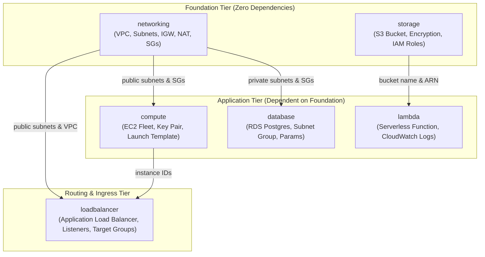
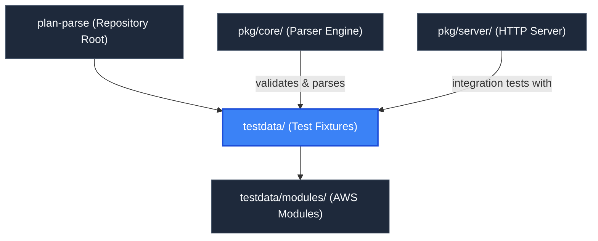

# Test Fixtures & Infrastructure Suite (`testdata`)

> **Parent Documentation**: For the higher-level architecture, see [Repository Root](../README.md)

The `testdata` directory contains a comprehensive Terraform test suite and realistic infrastructure fixture modeling a production-grade multi-tier AWS environment. It serves a dual purpose: providing repeatable test fixtures for backend unit/integration tests (`pkg/core` and `pkg/server`) and offering an out-of-the-box plan dataset (`tf_plan.json`) for manual exploration and UI validation.

---

## Infrastructure Topology & Module Architecture

The fixture models a distributed cloud application using synthetic provider resources (`null_resource`, `random_*`, `tls_*`, `local_file`) to emulate AWS resources without incurring cloud costs or requiring AWS credentials.



---

## Internal Mechanics & Fixture Subsystems

### 1. Root Orchestration (`main.tf`)
The root module wires together the 6 child modules, establishing cross-module dependency links:
- `module.networking`: Produces VPC IDs, public subnets, private subnets, and default security groups.
- `module.storage`: Produces an S3 bucket name, ARN, and IAM policy attachments.
- `module.compute`: Consumes `module.networking.public_subnet_ids` and security group IDs to deploy an EC2 instance fleet.
- `module.database`: Consumes `module.networking.private_subnet_ids` and security group IDs to deploy a multi-AZ RDS database.
- `module.lambda`: Consumes `module.storage.bucket_name` and `bucket_arn` to configure serverless event processing.
- `module.loadbalancer`: Consumes `module.networking.public_subnet_ids` and `module.compute.instance_ids` to attach compute nodes to an Application Load Balancer target group.

### 2. Module Manifest (`.terraform/modules/modules.json`)
The Terraform CLI generates `.terraform/modules/modules.json` during `terraform init`. It tracks where each module resides on the local filesystem:
```json
{
  "Modules": [
    { "Key": "networking", "Source": "./modules/networking", "Dir": "modules/networking" },
    { "Key": "storage", "Source": "./modules/storage", "Dir": "modules/storage" },
    { "Key": "compute", "Source": "./modules/compute", "Dir": "modules/compute" },
    { "Key": "database", "Source": "./modules/database", "Dir": "modules/database" },
    { "Key": "lambda", "Source": "./modules/lambda", "Dir": "modules/lambda" },
    { "Key": "loadbalancer", "Source": "./modules/loadbalancer", "Dir": "modules/loadbalancer" }
  ]
}
```
`pkg/core/modules.go` reads this manifest to locate module `.tf` files, allowing the parser to extract source code filenames and line numbers for every resource node.

### 3. Pre-Exported Plan Fixture (`tf_plan.json`)
- **Format Version**: `1.2`
- **Terraform Version**: `1.16.2`
- **Resource Changes**: 66 total resources slated for `create` action.
- **Coverage**: Exercises data sources, indexed resources (`count`), iterative resources (`for_each`), lifecycle rules (`ignore_changes`, `create_before_destroy`), nested attribute changes, and complex references (`local.*`, `terraform.workspace`).

---

## Key Files & Structure

| File / Directory | Type | Description |
| :--- | :--- | :--- |
| `main.tf` | Terraform Root | Instantiates and cross-wires the 6 child modules. |
| `variables.tf` | Terraform Inputs | Declares configuration parameters (CIDR blocks, instance counts, AZs, tags). |
| `outputs.tf` | Terraform Outputs | Exposes top-level endpoints, VPC IDs, and resource references. |
| `providers.tf` | Provider Config | Configures synthetic providers (`null`, `random`, `tls`, `local`). |
| `backend.tf` | State Config | Configures local state storage. |
| `tf_plan.json` | Plan Artifact | Fully exported 66-resource Terraform plan JSON fixture. |
| `.terraform/modules/modules.json` | Module Manifest | Path resolution registry for local module inspection. |
| [`modules/`](./modules/README.md) | Module Subtree | Directory containing the 6 individual AWS mock modules. |

---

## Hierarchy & Reference Graph

For more details about this section, check out [Mock AWS Infrastructure Modules](./modules/README.md)

This section connects to [Core Parser Engine](../pkg/core/README.md) for parsing tests and [Go Server Backend](../pkg/server/README.md) for lifecycle integration testing.


