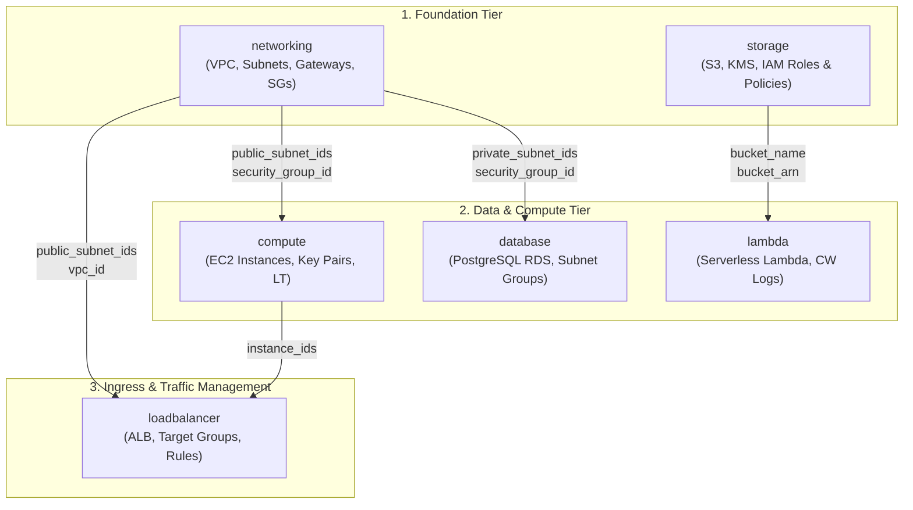
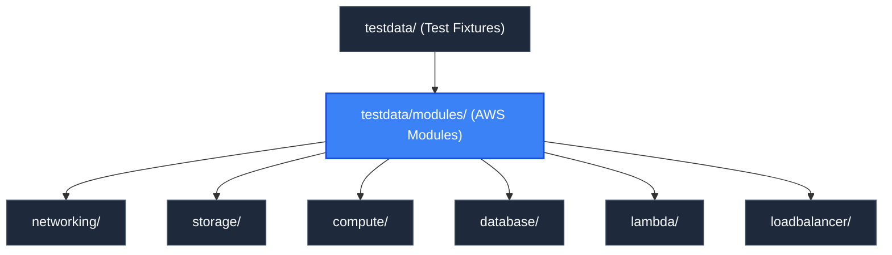

# Mock Infrastructure Modules (`testdata/modules`)

> **Parent Documentation**: For the higher-level architecture, see [Test Fixtures Suite](../README.md)

The `testdata/modules` directory contains 6 modular Terraform packages that simulate a scalable AWS cloud architecture. Each module encapsulates a specific infrastructure domain—networking, object storage, compute virtualization, relational databases, serverless functions, and traffic routing—using synthetic providers to generate realistic dependency graphs for `plan-parse`.

---

## Inter-Module Dependency Architecture

The modules form a multi-tier Directed Acyclic Graph (DAG) with well-defined ingress, egress, and cross-tier resource bindings:

---

## Module Catalog

| Module | Emulated AWS Services | Cross-Module Dependencies | Downstream Consumers |
| :--- | :--- | :--- | :--- |
| [`networking`](./networking/README.md) | VPC, Public/Private Subnets, IGW, NAT Gateway, Route Tables, Security Group | None (Root foundation) | `compute`, `database`, `loadbalancer` |
| [`storage`](./storage/README.md) | S3 Bucket, Versioning, KMS Encryption, IAM Role, IAM Policy | None (Root foundation) | `lambda` |
| [`compute`](./compute/README.md) | EC2 Instances, Key Pairs, Launch Templates, SG Rules | `networking` | `loadbalancer` |
| [`database`](./database/README.md) | RDS PostgreSQL, DB Subnet Group, DB Parameter Group | `networking` | None (End storage tier) |
| [`lambda`](./lambda/README.md) | Lambda Function, Execution Role, CloudWatch Log Group | `storage` | None (Worker tier) |
| [`loadbalancer`](./loadbalancer/README.md) | Application Load Balancer, Target Groups, Listeners, Routing Rules | `networking`, `compute` | None (Ingress tier) |

---

## Emulation Techniques & Synthetic Patterns

To generate rich dependency DAGs with complete Terraform plan metadata without requiring AWS credentials or cloud billing, each module utilizes standard Terraform utility providers:
1. **`hashicorp/null` (`null_resource`)**: Used to represent AWS infrastructure resources (`aws_vpc`, `aws_instance`, `aws_db_instance`, `aws_lb`). Resource triggers mimic real cloud attributes (e.g., `triggers = { vpc_id = null_resource.vpc.id }`).
2. **`hashicorp/random` (`random_id`, `random_pet`, `random_password`, `random_integer`)**: Simulates cloud resource name generation, unique suffixes, secure database credentials, and dynamic intervals.
3. **`hashicorp/tls` (`tls_private_key`, `tls_self_signed_cert`)**: Generates realistic 4096-bit RSA SSH keys and X.509 certificates for compute instances and HTTPS load balancer listeners.
4. **`hashicorp/local` (`local_file`)**: Simulates side-effect artifacts such as exported SSH key pairs, IAM policy documents, and JSON configuration manifests.

---

## Hierarchy & Reference Graph

For more details about this section, check out [Networking Module](./networking/README.md)
For more details about this section, check out [Storage Module](./storage/README.md)
For more details about this section, check out [Compute Module](./compute/README.md)
For more details about this section, check out [Database Module](./database/README.md)
For more details about this section, check out [Lambda Module](./lambda/README.md)
For more details about this section, check out [Load Balancer Module](./loadbalancer/README.md)

This section connects to [Core Parser Engine](../../pkg/core/README.md) for parsing tests and [Go Server Backend](../../pkg/server/README.md) for lifecycle integration testing.

