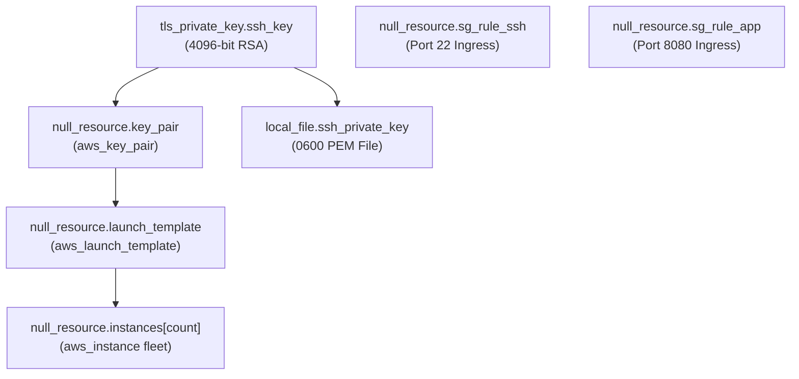
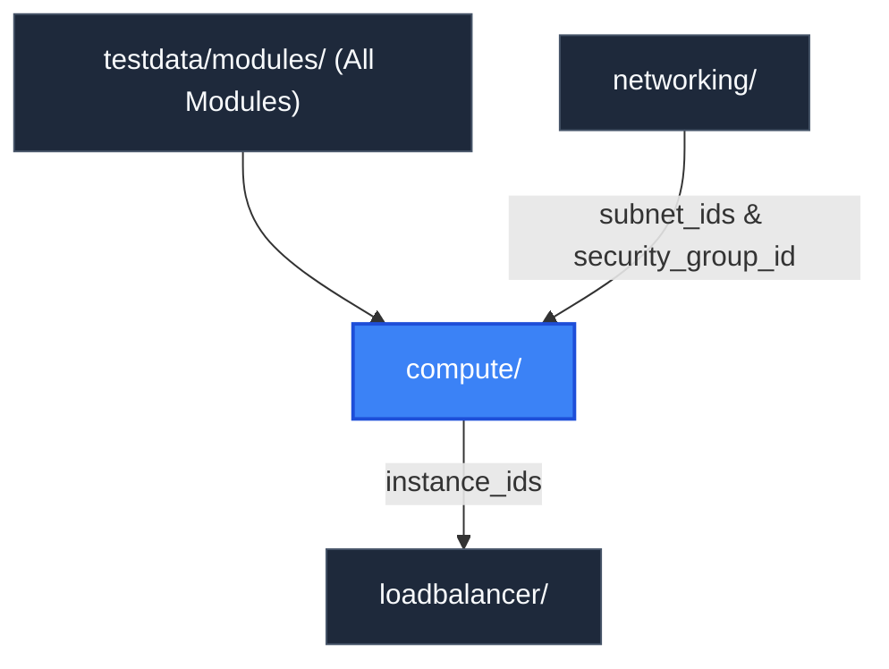

# Compute Module (`testdata/modules/compute`)

> **Parent Documentation**: For the higher-level architecture, see [Infrastructure Modules](../README.md)

The `compute` module provisions virtual compute instances and host-level access configurations. It emulates Amazon Elastic Compute Cloud (EC2) virtual machines, RSA cryptographic key pairs, EC2 launch templates, and dedicated security group ingress rules.

---

## Internal Resource Dependency Graph



---

## Architecture & Implementation Details

1. **Cryptographic Key Management**:
   Generates a dedicated 4096-bit RSA key pair via `tls_private_key` and outputs a restricted `0600` permission private key file to disk via `local_file`.
2. **Launch Template Zero-Downtime Rollouts**:
   The launch template employs `create_before_destroy = true` to model blue-green and zero-downtime AMI replacement strategies:
   ```hcl
   lifecycle {
     create_before_destroy = true
   }
   ```
3. **Multi-Subnet Instance Distribution**:
   Instances distribute across public subnets using modulo arithmetic: `var.subnet_ids[count.index % length(var.subnet_ids)]`.
4. **Security Group Rules**:
   Injects ingress rules for SSH (port 22 from `10.0.0.0/16`) and HTTP application traffic (port 8080 from `0.0.0.0/0`) into the shared security group provided by the networking module.

---

## Key Files & Configuration

| File | Purpose |
| :--- | :--- |
| `main.tf` | Defines TLS keys, key pairs, launch template, EC2 instances, and security rules. |
| `variables.tf` | Declares instance counts, instance types, subnet arrays, and SG IDs. |
| `outputs.tf` | Exposes instance ID lists, launch template IDs, and key pair names. |

### Inputs Consumed
- `project`: Project name prefix.
- `environment`: Deployment tier environment (`dev`, `staging`, `prod`).
- `instance_count`: Number of EC2 instances to provision.
- `instance_type`: EC2 instance type family (e.g. `t3.micro`).
- `subnet_ids`: Public subnet IDs supplied by `networking`.
- `security_group_id`: VPC security group supplied by `networking`.
- `vpc_id`: Network container ID supplied by `networking`.
- `tags`: Common metadata tags applied across compute resources.

### Exported Outputs
- `instance_ids`: List of simulated EC2 instance IDs consumed by the load balancer target group.
- `ssh_public_key`: Generated 4096-bit RSA SSH public key.
- `key_pair_id`: Logical identifier of the synthetic key pair resource.
- `launch_template_id`: Logical identifier of the zero-downtime launch template.

---

## Hierarchy & Reference Graph

This section connects to [Networking Module](../networking/README.md) for network placement and [Load Balancer Module](../loadbalancer/README.md) for target registration.


