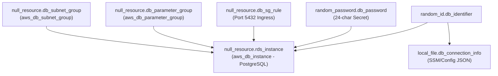
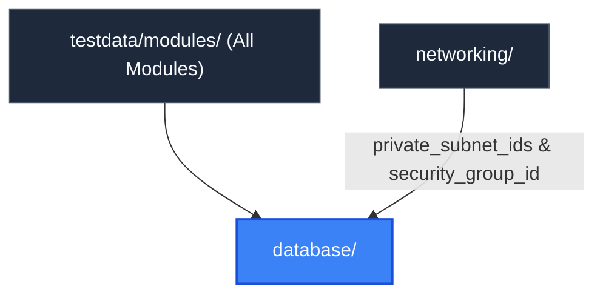

# Database Module (`testdata/modules/database`)

> **Parent Documentation**: For the higher-level architecture, see [Infrastructure Modules](../README.md)

The `database` module provisions persistent relational database infrastructure within private network subnets. It emulates Amazon Relational Database Service (RDS) running PostgreSQL, database subnet groups, parameter groups, cryptographically random master passwords, and ingress security group rules.

---

## Internal Resource Dependency Graph

---

## Architecture & Implementation Details

1. **Private Subnet Placement**:
   Binds to `var.subnet_ids` (supplied by the `networking` module's private subnets) to ensure zero direct public internet exposure.
2. **Dynamic Parameter Family Resolution**:
   Dynamically determines the parameter family using regex: `${var.db_engine}${regex("^\\d+", var.db_engine_version)}` (e.g. `postgres15`). Employs `create_before_destroy = true` to allow live parameter group updates.
3. **Automated Secret Generation**:
   Uses `random_password` with 24 characters and special character overrides to simulate AWS Secrets Manager password generation.
4. **VPC Ingress Protection**:
   Configures ingress rule `null_resource.db_sg_rule` to restrict database port 5432 access strictly to the VPC CIDR (`10.0.0.0/16`).

---

## Key Files & Configuration

| File | Purpose |
| :--- | :--- |
| `main.tf` | Defines DB subnet groups, parameter groups, RDS instances, and connection manifests. |
| `variables.tf` | Declares database engine, version, instance classes, subnets, and SG IDs. |
| `outputs.tf` | Exposes RDS endpoints, connection ports, and parameter group identifiers. |

### Inputs Consumed
- `subnet_ids`: Private subnets from `networking`.
- `security_group_id`: VPC security group from `networking`.
- `vpc_id`: VPC identifier from `networking`.

---

## Hierarchy & Reference Graph

This section connects to [Networking Module](../networking/README.md) for private subnet isolation and security group access.

