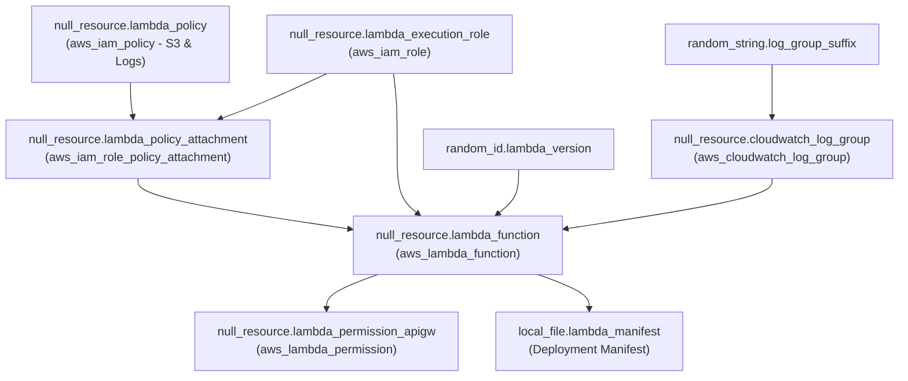
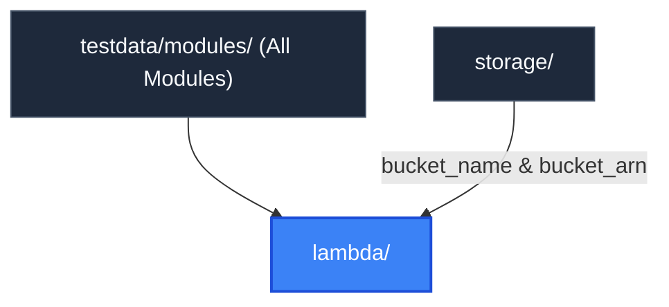

# Lambda Module (`testdata/modules/lambda`)

> **Parent Documentation**: For the higher-level architecture, see [Infrastructure Modules](../README.md)

The `lambda` module provisions event-driven, serverless execution infrastructure. It emulates AWS Lambda functions, IAM execution roles, least-privilege IAM policies, Amazon CloudWatch log groups, and API Gateway invocation permissions.

---

## Internal Resource Dependency Graph

---

## Architecture & Implementation Details

1. **Cross-Module Storage Dependency**:
   Consumes `var.bucket_arn` and `var.bucket_name` directly from the `storage` module. The IAM policy restricts S3 read/write actions strictly to `${var.bucket_arn}/*`.
2. **Log Group Initialization Ordering**:
   Creates the CloudWatch log group *before* the function via `depends_on = [null_resource.cloudwatch_log_group]` to prevent default auto-generated log groups without retention rules.
3. **Deployment Version Hashing**:
   Uses `random_id.lambda_version` keyed to runtime, memory, timeout, and bucket name to simulate source code checksums (`source_code_hash`).

---

## Key Files & Configuration

| File | Purpose |
| :--- | :--- |
| `main.tf` | Defines Lambda function, execution role, CloudWatch log group, and permissions. |
| `variables.tf` | Declares runtime (`nodejs18.x`), memory size, timeout, and storage bucket bindings. |
| `outputs.tf` | Exposes function names, function ARNs, and log group names. |

### Inputs Consumed
- `project`: Project name prefix.
- `environment`: Deployment tier environment (`dev`, `staging`, `prod`).
- `runtime`: Lambda execution runtime (e.g. `nodejs18.x`, `python3.11`).
- `memory_size`: Memory allocation in megabytes (e.g. `256`).
- `timeout`: Execution timeout in seconds (e.g. `30`).
- `bucket_name`: Name of the S3 bucket from `storage`.
- `bucket_arn`: ARN of the S3 bucket from `storage`.
- `tags`: Common metadata tags applied across lambda resources.

### Exported Outputs
- `function_name`: Logical name of the synthetic Lambda function.
- `function_id`: Resource identifier of the synthetic Lambda function.
- `log_group_name`: CloudWatch log group name created with explicit retention.
- `execution_role_id`: IAM execution role identifier with CloudWatch and S3 permissions.
- `lambda_permission_id`: API Gateway invocation permission identifier.

---

## Hierarchy & Reference Graph

This section connects to [Storage Module](../storage/README.md) for S3 code bucket inputs and IAM permission boundaries.

