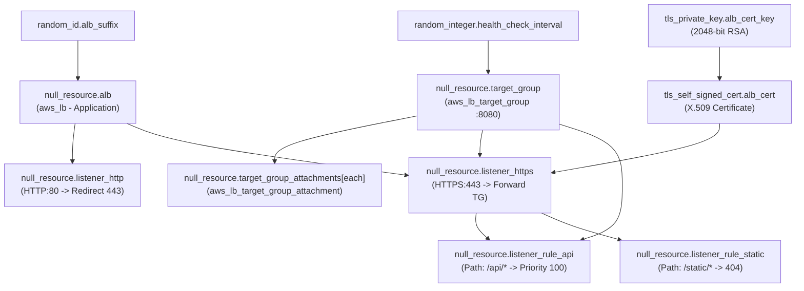
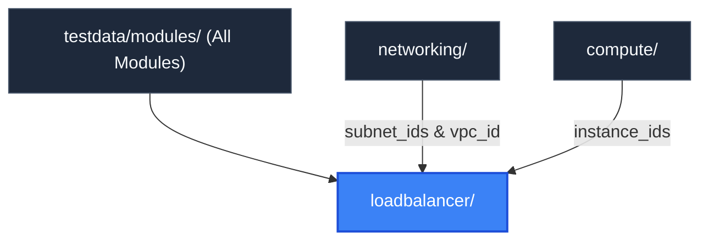

# Load Balancer Module (`testdata/modules/loadbalancer`)

> **Parent Documentation**: For the higher-level architecture, see [Infrastructure Modules](../README.md)

The `loadbalancer` module provisions public traffic ingress and routing infrastructure. It emulates an AWS Application Load Balancer (ALB), target groups, target group instance attachments, HTTP-to-HTTPS redirect listeners, TLS termination certificates, and path-based listener rules.

---

## Internal Resource Dependency Graph



---

## Architecture & Implementation Details

1. **Dual Cross-Module Ingress Binding**:
   Consumes `subnet_ids` and `vpc_id` from the `networking` module to place the load balancer across public availability zones, and `instance_ids` from the `compute` module to register targets.
2. **Dynamic Target Attachment with `for_each`**:
   Iterates over the compute instance list using Terraform `for_each`:
   ```hcl
   resource "null_resource" "target_group_attachments" {
     for_each = { for i, id in var.instance_ids : tostring(i) => id }
     triggers = {
       target_group_id = null_resource.target_group.id
       target_id       = each.value
       port            = "8080"
     }
   }
   ```
3. **Automated SSL/TLS Termination**:
   Generates a synthetic 2048-bit RSA key and X.509 self-signed certificate (`example.com`) to demonstrate how HTTPS listeners and ACM certificates appear in plan DAGs.
4. **Path-Based Routing Rules**:
   - Priority 100: Routes `/api/*` requests forward to the compute target group.
   - Priority 200: Returns a fixed `404` plain text response for missing `/static/*` assets.

---

## Key Files & Configuration

| File | Purpose |
| :--- | :--- |
| `main.tf` | Defines ALB, target groups, attachments, HTTP/HTTPS listeners, TLS certificates, and rules. |
| `variables.tf` | Declares VPC IDs, public subnet arrays, and compute instance IDs. |
| `outputs.tf` | Exposes ALB DNS names, ARNs, target group ARNs, and listener identifiers. |

### Inputs Consumed
- `subnet_ids`: Public subnets supplied by `networking`.
- `project`: Project name prefix.
- `environment`: Deployment tier environment (`dev`, `staging`, `prod`).
- `subnet_ids`: Public subnet IDs supplied by `networking`.
- `vpc_id`: Network container ID supplied by `networking`.
- `instance_ids`: EC2 instance fleet IDs supplied by `compute`.
- `tags`: Common metadata tags applied across load balancer resources.

### Exported Outputs
- `alb_dns_name`: Fully qualified synthetic ALB DNS hostname.
- `alb_arn`: Canonical ARN string of the Application Load Balancer.
- `alb_id`: Resource identifier of the synthetic ALB.
- `target_group_id`: Resource identifier of the HTTP target group on port 8080.
- `listener_http_id`: HTTP port 80 redirect listener identifier.
- `listener_https_id`: HTTPS port 443 TLS termination listener identifier.

---

## Hierarchy & Reference Graph

This section connects to [Networking Module](../networking/README.md) for public subnets and [Compute Module](../compute/README.md) for instance target group registration.


