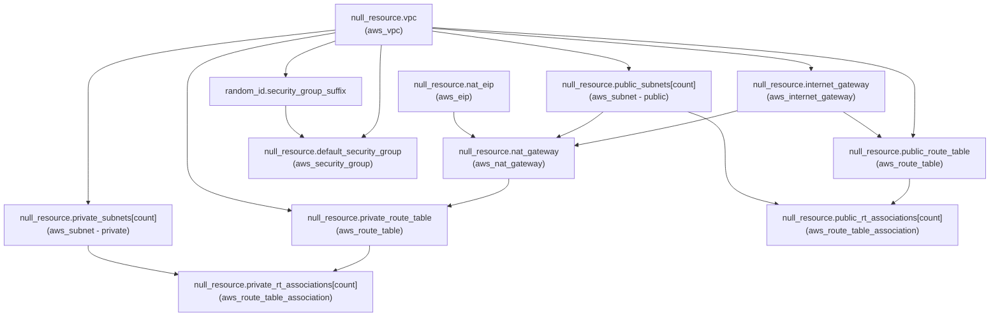
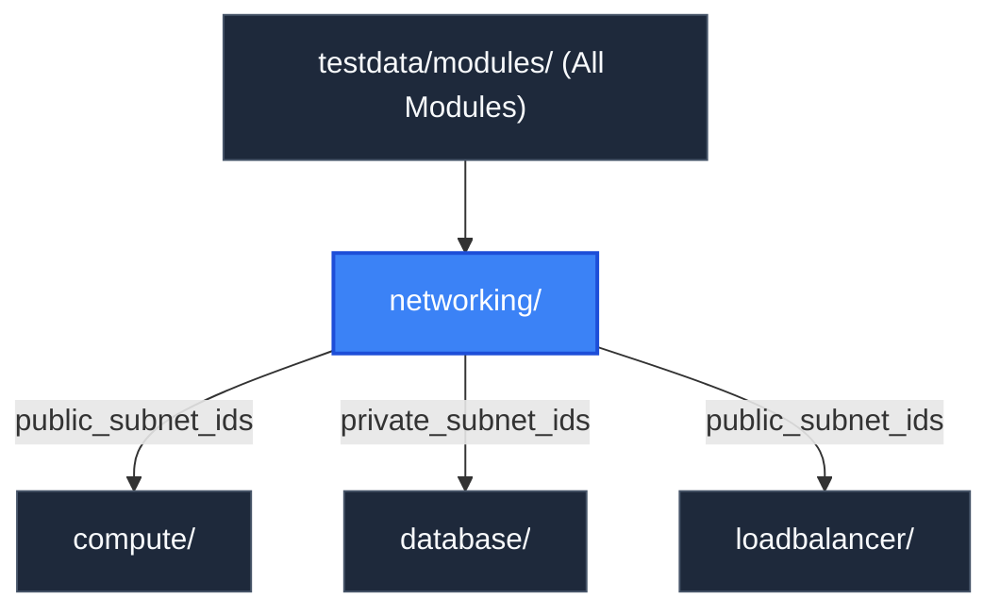

# Networking Module (`testdata/modules/networking`)

> **Parent Documentation**: For the higher-level architecture, see [Infrastructure Modules](../README.md)

The `networking` module provisions the foundational virtual network topology for the test environment. It emulates Amazon Virtual Private Cloud (VPC), public and private multi-AZ subnets, Internet Gateways, NAT Gateways, route tables, associations, and security groups.

---

## Internal Resource Dependency Graph

The resources within this module form a strict internal hierarchy rooted at the VPC:



---

## Architecture & Implementation Details

1. **Subnet Partitioning**:
   Uses `cidrsubnet(var.vpc_cidr, 8, count.index)` to allocate non-overlapping `/24` subnets across availability zones for public and private networks.
2. **NAT Gateway Routing**:
   The private route table depends on the active NAT Gateway located in the primary public subnet, simulating AWS egress routing for private instances.
3. **Lifecycle Management**:
   The default security group employs the `ignore_changes` lifecycle hook to demonstrate how Terraform plans reflect in-place change omissions:
   ```hcl
   lifecycle {
     ignore_changes = [triggers["egress_all"]]
   }
   ```

---

## Key Files & Configuration

| File | Purpose |
| :--- | :--- |
| `main.tf` | Declares VPC, subnets, gateways, route tables, and security group resources. |
| `variables.tf` | Declares input parameters (`vpc_cidr`, `availability_zones`, `project`, `environment`, `tags`). |
| `outputs.tf` | Exposes VPC IDs, CIDR blocks, subnet arrays, and security group identifiers. |

### Inputs Consumed
- `project`: Project name prefix for naming synthetic resources.
- `environment`: Deployment tier environment (`dev`, `staging`, `prod`).
- `vpc_cidr`: Baseline IPv4 CIDR block for the VPC (e.g. `10.0.0.0/16`).
- `availability_zones`: List of availability zones for public and private subnet distribution.
- `tags`: Common metadata tags applied across resources.

### Exported Outputs
- `vpc_id`: Logical identifier of the synthetic VPC.
- `public_subnet_ids`: List of public subnet IDs consumed by compute and load balancer modules.
- `private_subnet_ids`: List of private subnet IDs consumed by the database module.
- `security_group_id`: Common baseline security group for VPC workloads.

---

## Hierarchy & Reference Graph

This section connects to [Compute Module](../compute/README.md), [Database Module](../database/README.md), and [Load Balancer Module](../loadbalancer/README.md) by providing foundational VPC and subnet IDs.


