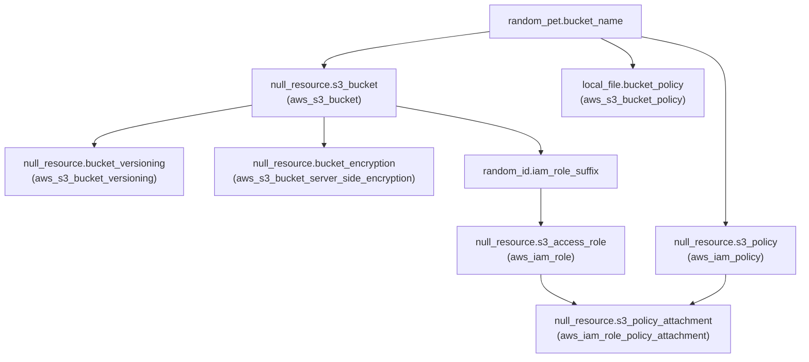
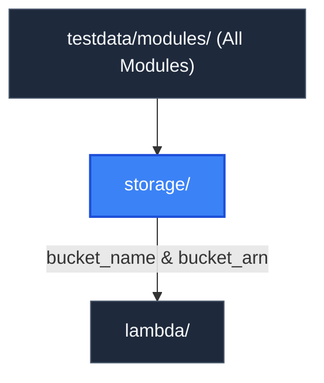

# Storage Module (`testdata/modules/storage`)

> **Parent Documentation**: For the higher-level architecture, see [Infrastructure Modules](../README.md)

The `storage` module provisions durable cloud object storage and identity permissions for the test infrastructure. It emulates Amazon Simple Storage Service (S3) buckets, bucket versioning configurations, server-side KMS encryption, IAM roles, read/write IAM policies, and role policy attachments.

---

## Internal Resource Dependency Graph

---

## Architecture & Implementation Details

1. **Unique Naming Semantics**:
   Uses `random_pet` to generate globally distinct bucket names prefixed with `${project}-${environment}`.
2. **Security & Encryption**:
   Enforces synthetic KMS encryption (`aws:kms`) and SSL-only bucket access policies via `local_file.bucket_policy`.
3. **IAM Role & Policy Decoupling**:
   Generates an EC2-assumable IAM role and binds it to a least-privilege S3 read/write policy through `null_resource.s3_policy_attachment`.

---

## Key Files & Configuration

| File | Purpose |
| :--- | :--- |
| `main.tf` | Defines S3 bucket, versioning, encryption, IAM role, and policy attachments. |
| `variables.tf` | Declares project identifiers, environment, deployment region, and tags. |
| `outputs.tf` | Exposes bucket names, bucket ARNs, and IAM policy identifiers. |

### Exported Outputs
- `bucket_name`: Unique pet-generated bucket name.
- `bucket_arn`: Synthetic ARN (`arn:aws:s3:::<bucket_name>`) consumed by downstream modules.
- `iam_role_arn`: ARN of the generated access role.

---

## Hierarchy & Reference Graph

This section connects to [Lambda Module](../lambda/README.md) for providing S3 code bucket storage and IAM authorization.

