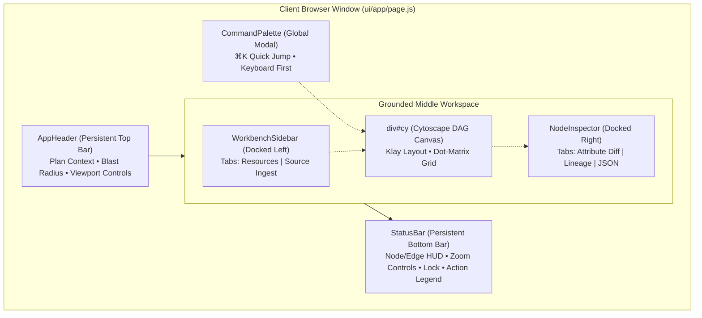
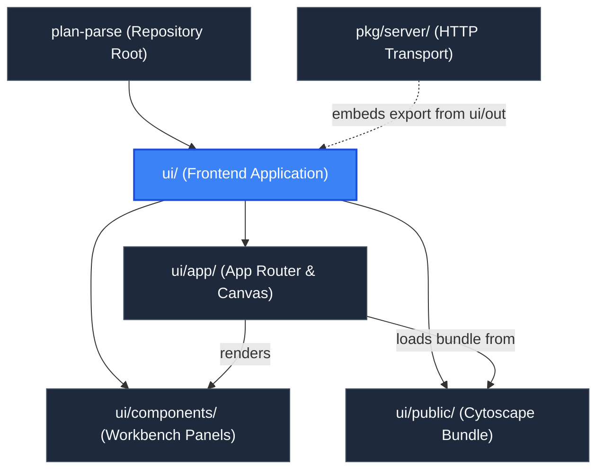

# Frontend Application (`ui`)

> **Parent Documentation**: For the higher-level architecture, see [Repository Root](../README.md)

The `ui` directory contains the Next.js 14 single-page application (SPA) providing the Developer Workbench for `plan-parse`. Built with React 18, Tailwind CSS, and Cytoscape.js, it replaces legacy floating overlays with a grounded, high-density engineering interface designed for exploring complex Terraform dependency graphs, inspecting granular attribute diffs, and assessing blast radius.

---

## Technical Stack & Layout Model

- **Framework**: Next.js 14 (App Router) configured for fully static export (`output: 'export'`, `distDir: 'out'`).
- **Graph Engine**: Cytoscape.js paired with the Eclipse Klay hierarchical layout algorithm (`cytoscape-klay`), loaded synchronously from a standalone bundle.
- **Typography**: DM Sans for primary user interface text and DM Mono for addresses, metrics, and code attributes.
- **Workbench Theme**: Grounded dark workbench palette (`bg-workbench-bg`, `bg-workbench-header`, `bg-workbench-panel`, `bg-workbench-subpanel`, `bg-workbench-border`, `bg-workbench-hover`).
- **State Architecture**: Client-side React state hooks (`useState`, `useRef`, `useCallback`, `useMemo`, `useDeferredValue`) isolating DAG structures strictly within the browser tab.



---

## Client-Side State Isolation Across Tabs

The visualization engine relies entirely on local browser state (`useState(graphData)`):
- **Zero Server State**: The Go backend does not store sessions, plan payloads, or user preferences in memory, cookies, or databases.
- **Multi-Tab Independence**: Because DAG state lives solely within each browser tab's React component tree, engineers can open multiple browser tabs simultaneously to visualize different Terraform plans (e.g. comparing plan stages or environments) against the same running backend server without cross-talk or collision.
- **Lifecycle Transition**: When the server launches with a pre-loaded CLI plan (`-plan` or `-dir`), the first tab fetches the plan via single-use lifecycle flags. Opening additional tabs or refreshing automatically unlocks into the interactive plan ingestion workbench.

---

## Workbench UI Subsystems

### 1. Persistent Application Header (`components/AppHeader.js`)
Grounded 44px top navigation bar housing:
- Application branding and mode indicator (`CLI Mode` amber pill or plan filename).
- Blast-radius summary pills showing counts for `+create` (green), `~update` (blue), `-delete` (red), and `±replace` (amber).
- Command Palette trigger button (`⌘K`).
- Canvas actions: `Fit` (`f`), `1:1` (`0`), `Load Plan`/`Replace Plan`, and sidebar/inspector toggle buttons (`[`, `]`).

### 2. Docked Left Sidebar (`components/WorkbenchSidebar.js`)
Collapsible 320px docked left panel with dual tabs:
- **Resources Tab**: Proportional blast radius distribution bar, instant text filter with `useDeferredValue`, action filter chips (`all`, `create`, `update`, `delete`, `replace`, `no-op`, `read`), module grouping toggle, and two-way synchronization with canvas selections.
- **Source Tab**: Drag-and-drop zone for plan JSON files with client-side pre-flight validation (file size <= 50MB, `.json` extension, valid JSON syntax, non-empty `format_version` and `terraform_version`), plan metadata summary card, and stateless submission to `POST /api/parse`.

### 3. Central Canvas Viewport (`app/page.js` & `#cy`)
- High-performance Cytoscape DAG viewport with dot-matrix grid background (`.canvas-bg`).
- Hierarchical Klay layout organizing nodes left-to-right (`direction: 'RIGHT'`).
- Dynamic viewport recalibration (`cy.resize()`) debounced upon toggling docked sidebars to prevent clipping.
- Tap-to-focus with smooth cubic animations (`cy.animate()`), highlighting direct upstream and downstream dependencies while dimming unrelated elements.
- Empty canvas guidance card displaying the CLI export command (`terraform show -json tfplan > plan.json`) and ingestion prompt.

### 4. Docked Right Inspector (`components/NodeInspector.js`)
Collapsible 384px slide-over inspector displaying:
- **Attribute Diff Tab**: Granular attribute changes comparing `before` and `after` blocks (`+ ADDED`, `- REMOVED`, `~ MODIFIED`, `= SAME`) with strikethrough before-values.
- **Lineage Tab**: Upstream dependencies (`Depends On`) and downstream blast radius (`Referenced By`) with one-click camera focus buttons.
- **Raw JSON Tab**: Formatted JSON definition with quick address clipboard copy.

### 5. Grounded Engineering Status Bar (`components/StatusBar.js`)
Persistent 28px bottom status bar providing:
- Live graph metrics counter (`N nodes • N edges`).
- Interactive zoom percentage HUD with inline `-`/`+` step zoom controls.
- Viewport lock toggle (`LOCKED`/`UNLOCKED`).
- Integrated color-coded action legend dots (create, update, delete, replace, no-op).

### 6. Quick Navigation Command Palette (`components/CommandPalette.js`)
Keyboard-first search modal opened via `Cmd+K` / `Ctrl+K`:
- Real-time search across resource IDs, labels, resource types, modules, and action types.
- Full keyboard navigation (`ArrowUp`, `ArrowDown`, `Enter` to select and animate camera, `Escape` to close).

---

## Keyboard Shortcuts

| Shortcut | Description | Context / Scope |
| :--- | :--- | :--- |
| `[` | Toggle docked left sidebar | Global |
| `]` | Toggle docked right inspector | Global (when node is selected) |
| `Cmd+K` / `Ctrl+K` | Open / dismiss Command Palette modal | Global |
| `f` / `F` | Fit all graph nodes within canvas padding | Global |
| `+` / `=` | Smooth zoom in (factor 1.3) | Global |
| `-` | Smooth zoom out (factor 0.75) | Global |
| `0` | Reset camera zoom to 100% (1:1) | Global |
| `Escape` | Dismiss modal, clear selection, or reset canvas dimming | Global |

---

## Key Files & Exports

| File / Folder | Type | Description |
| :--- | :--- | :--- |
| [`app/`](./app/README.md) | Next.js App Router | Root layout (`layout.js`), global styles (`globals.css`), and the workbench canvas coordinator (`page.js`). |
| [`components/`](./components/README.md) | React Components | Workbench panels: `AppHeader`, `WorkbenchSidebar`, `NodeInspector`, `StatusBar`, and `CommandPalette`. |
| `lib/` | Utility Modules | Action color palettes (`action-theme.js`) and Cytoscape stylesheet rules (`cytoscape-styles.js`). |
| [`public/`](./public/README.md) | Static Assets | Standalone bundled Cytoscape.js and Klay layout library (`cytoscape-bundle.js`). |
| `tailwind.config.js` | Config | Tailwind theme extensions declaring DM Sans, DM Mono, and the `workbench-*` color palette. |
| `next.config.js` | Config | Configures Next.js static export settings (`output: 'export'`, `distDir: 'out'`). |
| `package.json` | Dependencies | Node dependencies (`next`, `react`, `react-dom`, `tailwindcss`, etc.). |

---

## Development & Build Commands

```bash
# Install dependencies
pnpm install

# Start local Next.js development server on port 3000
pnpm dev

# Compile static HTML/JS/CSS export into ui/out
pnpm run build
```

---

## Hierarchy & Reference Graph

For more details about orchestration, check out [App Router & Main Page](./app/README.md) and [Component Library](./components/README.md).


