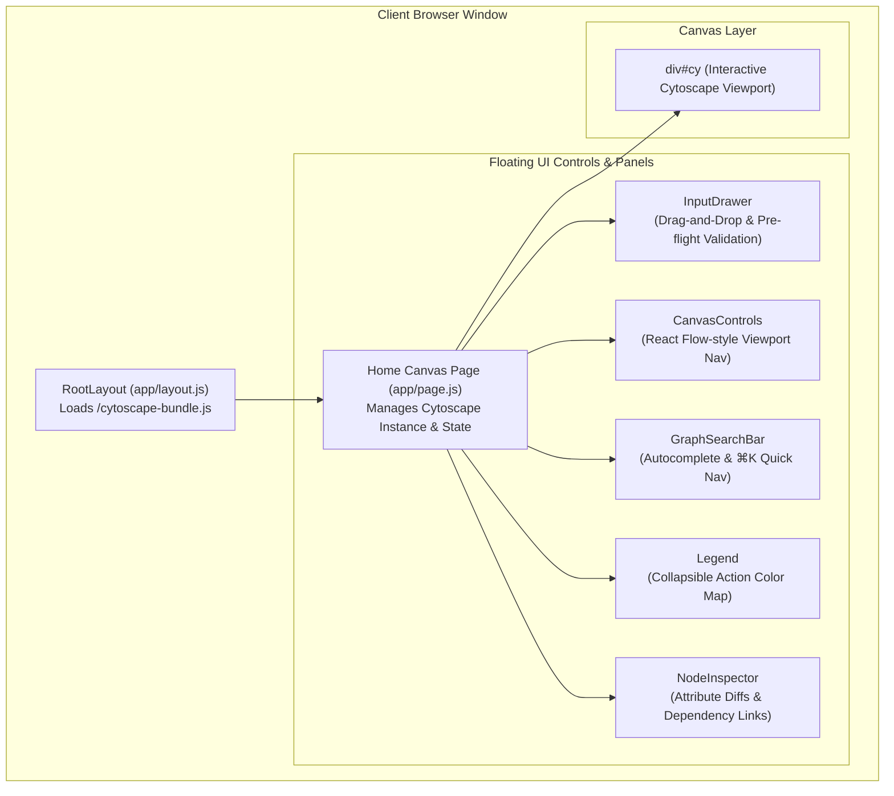
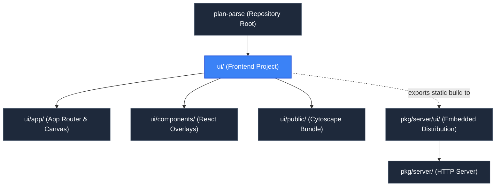

# Frontend Application (`ui`)

> **Parent Documentation**: For the higher-level architecture, see [Repository Root](../README.md)

The `ui` directory contains the modern Next.js 14 single-page application (SPA) that provides the interactive user interface for `plan-parse`. Designed with React 18, Tailwind CSS, and Cytoscape.js, it offers an intuitive visualization canvas for exploring complex Terraform dependency graphs, inspecting attribute diffs, and tracing infrastructure topology.

---

## Technical Stack & Architecture

- **Framework**: Next.js 14 (App Router) configured for fully static export (`output: 'export'`, `distDir: 'out'`).
- **Graph Engine**: Cytoscape.js paired with the Eclipse Klay layout algorithm (`cytoscape-klay`), loaded synchronously from a standalone bundle.
- **Styling**: Tailwind CSS with custom dark mode palettes, glassmorphism overlays (`backdrop-blur`), and responsive flex/grid layouts.
- **State Architecture**: Local React state hooks (`useState`, `useRef`, `useCallback`, `useMemo`) managing canvas viewport transformations, keyboard shortcuts, node selections, and drawer transitions.



---

## Internal Mechanics & UI Subsystems

### 1. Canvas Lifecycle & Initialization (`app/page.js`)
1. **Script Detection**: Monitors `window.cytoscape` loaded by `layout.js` before initializing the canvas DOM.
2. **Initial Sync**: Queries `GET /api/status` and `GET /api/graph`. If a CLI-provided plan was parsed at startup, it renders immediately. If no plan is active, it opens the `InputDrawer`.
3. **Klay Hierarchical Layout**: Runs `cytoscape-klay` with `direction: 'RIGHT'` and `nodeLayering: 'NETWORK_SIMPLEX'` to position parent modules, files, and resources in a clean left-to-right dependency hierarchy.
4. **Interaction Binding**: Binds click, double-click, and viewport change listeners to animate camera focus, highlight dependency paths, and dim unrelated graph elements.

### 2. Viewport Navigation & Keyboard Shortcuts
- `f` / `F`: Fit all nodes within the current viewport padding.
- `+` / `=`: Smooth zoom in by factor `1.3`.
- `-`: Smooth zoom out by factor `0.75`.
- `0`: Reset zoom level to `100%` (`1:1`).
- `Escape`: Deselect the active node inspector or close the input drawer.
- `⌘K` / `Ctrl+K`: Focus the resource quick search bar.

### 3. Build & Static Export
In `next.config.js`:
```javascript
const nextConfig = {
  output: 'export',
  distDir: 'out',
  trailingSlash: true,
  images: { unoptimized: true },
};
```
Running `pnpm run build` generates pure static HTML, CSS, and JS bundles into `ui/out`, removing the need for a Node.js server runtime in production.

---

## Key Files & Exports

| File / Folder | Type | Description |
| :--- | :--- | :--- |
| [`app/`](./app/README.md) | Next.js App Router | Contains the root layout (`layout.js`), global CSS (`globals.css`), and the core canvas page (`page.js`). |
| [`components/`](./components/README.md) | React Components | Floating UI overlays: `CanvasControls`, `GraphSearchBar`, `Legend`, `NodeInspector`, and `InputDrawer`. |
| [`public/`](./public/README.md) | Static Assets | Pre-bundled Cytoscape and Klay layout library (`cytoscape-bundle.js`). |
| `next.config.js` | Config | Configures Next.js static export settings. |
| `package.json` | Dependencies | Specifies dependencies (`next`, `react`, `react-dom`, `tailwindcss`, etc.). |
| `tailwind.config.js` | Config | Declares Tailwind CSS purge paths, theme extensions, and dark theme colors. |

---

## Development & Build Commands

```bash
# Install dependencies
pnpm install

# Start local Next.js development server on port 3000
pnpm dev

# Compile production static export to ui/out
pnpm run build
```

---

## Hierarchy & Reference Graph

For more details about this section, check out [App Router & Main Page](./app/README.md)
For more details about this section, check out [UI Component Library](./components/README.md)
For more details about this section, check out [Public Static Bundles](./public/README.md)

This section connects to [Go Server Backend](../pkg/server/README.md) for REST endpoints and [Embedded Distribution](../pkg/server/ui/README.md) for compiled binary packaging.


