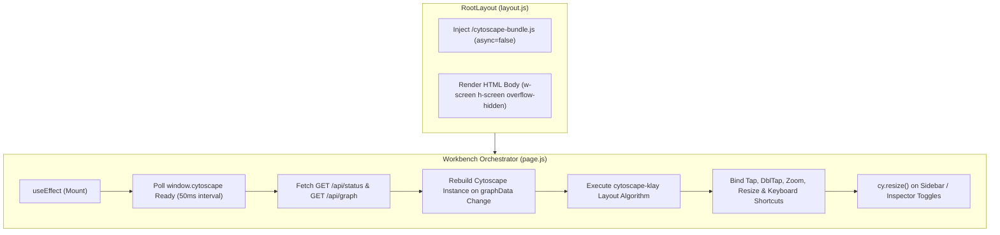
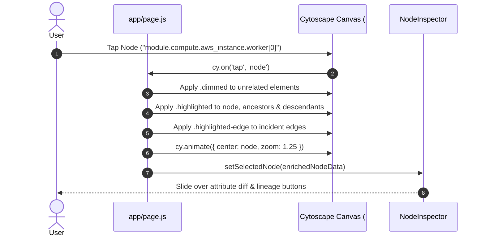
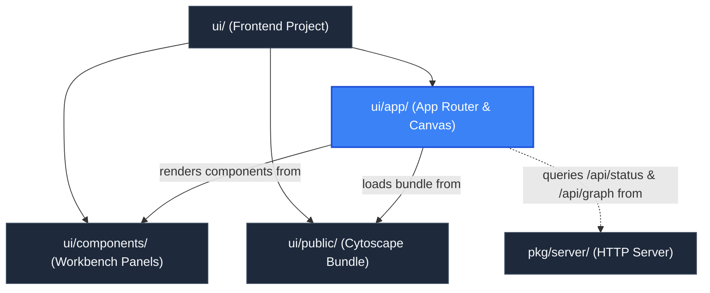

# App Router & Canvas Orchestration (`ui/app`)

> **Parent Documentation**: For the higher-level architecture, see [Frontend Application](../README.md)

The `ui/app` directory serves as the core Next.js App Router entry point for `plan-parse`. It defines the root HTML skeleton, injects global stylesheets, loads the synchronous Cytoscape bundle, and coordinates the developer workbench lifecycle in `page.js`.

---

## Architectural Mechanics

The application bridges Next.js static export conventions with client-side, imperative Cytoscape.js canvas rendering and a docked multi-panel workbench:



---

## Key Modules & Implementation Details

### 1. Root Layout (`layout.js`)
- **Bundle Injection**: Injects a synchronous `<script src="/cytoscape-bundle.js" async={false}>` tag directly into `<head>`. This ensures that Cytoscape.js and the Eclipse Klay layout algorithm (`cytoscape-klay`) are fully evaluated in global browser scope before React hydrates client components.
- **Root Container**: Constrains viewport bounds (`w-screen h-screen overflow-hidden`) and sets typography to DM Sans and DM Mono with a dark workbench background (`bg-workbench-bg text-slate-200`).

### 2. Workbench Canvas Orchestrator (`page.js`)
`page.js` is an imperative client coordinator managing the Cytoscape graph canvas, docked engineering panels, navigation controls, and hotkeys.

#### A. Comprehensive State Management
- `graphData` (`useState`): Holds the active Cytoscape graph object (`{ nodes, edges, summary }`).
- `cliLoaded` / `disabled` (`useState`): Tracks whether the active plan was pre-loaded via CLI flags (`-plan` or `-dir`).
- `planName` (`useState`): Stores the active plan name or uploaded filename.
- `isSidebarOpen` (`useState`, default `true`): Controls docked left sidebar visibility.
- `sidebarTab` (`useState`, `"resources"` | `"source"`): Controls active sidebar tab.
- `isInspectorOpen` (`useState`, default `true`): Controls docked right inspector panel visibility.
- `selectedNode` (`useState`): Stores the currently inspected node enriched with upstream (`incomers`) and downstream (`outgoers`) dependency IDs.
- `zoomLevel` (`useState`, default `1`): Tracks the live Cytoscape camera zoom ratio.
- `isLocked` (`useState`, default `false`): Toggles Cytoscape navigation pan/zoom lock.
- `cyReady` (`useState`): Tracks synchronous script tag availability of `window.cytoscape`.
- `isCommandPaletteOpen` (`useState`, default `false`): Controls visibility of the `Cmd+K` command palette.

#### B. Dynamic Canvas Viewport Recalibration (`cy.resize()`)
Because the workbench uses docked sidebars rather than floating overlays, opening or closing `WorkbenchSidebar` or `NodeInspector` changes the available canvas DOM width. To prevent graph stretching or clipping:
```javascript
useEffect(() => {
  if (!cyRef.current) return;
  const timer = setTimeout(() => {
    if (cyRef.current && !cyRef.current.destroyed()) {
      cyRef.current.resize();
    }
  }, 150);
  return () => clearTimeout(timer);
}, [isSidebarOpen, isInspectorOpen, selectedNode]);
```

#### C. Klay Hierarchical Layout Execution
Whenever `graphData` updates, any existing Cytoscape instance is cleanly destroyed and reconstructed. Nodes and edges are inserted, followed by the execution of the Eclipse Klay layout:
```javascript
const layout = cy.layout({
  name: "klay",
  nodeDimensionsIncludeLabels: true,
  fit: true,
  padding: 50,
  klay: {
    direction: "RIGHT",
    borderSpacing: 40,
    spacing: 30,
    nodeLayering: "NETWORK_SIMPLEX",
  },
});
layout.run();
```

#### D. Node Selection, Blast Radius Highlighting & Camera Animation
- **Single-Tap Selection**: Tapping a node extracts connected dependencies (`incomers` and `outgoers`), applies `.dimmed` (low opacity) to unrelated elements, adds `.highlighted` and `.highlighted-edge` (`#38bdf8` glowing border) to the selected node and its direct dependencies, and smoothly centers the camera via `cy.animate({ center: { eles: node }, zoom: Math.max(cy.zoom(), 1.25), duration: 400 })`.
- **Double-Tap Quick Centering**: Double-tapping centers camera focus on the target node and zooms in (`Math.max(cy.zoom(), 1.3)`).
- **Escape Key Handling**: Clears `selectedNode`, dismisses active panels/palettes, and removes all `.dimmed` and `.highlighted` classes across elements.

#### E. Global Keyboard Shortcuts
| Key Combo | Action | Handler |
| :--- | :--- | :--- |
| `[` | Toggle docked left sidebar | `setIsSidebarOpen(prev => !prev)` |
| `]` | Toggle docked right inspector | `setIsInspectorOpen(prev => !prev)` |
| `Cmd+K` / `Ctrl+K` | Open / toggle Command Palette | `setIsCommandPaletteOpen(prev => !prev)` |
| `f` / `F` | Fit canvas elements to viewport | `handleFit()` (`cy.animate({ fit: ... })`) |
| `+` / `=` | Smooth zoom in by factor 1.3 | `handleZoomIn()` |
| `-` | Smooth zoom out by factor 0.75 | `handleZoomOut()` |
| `0` | Reset zoom to 100% (1:1) | `handleResetZoom()` |
| `Escape` | Close palette or deselect active node | Resets selection and clears canvas dimming |

#### F. Tab-Level State Isolation
All parsed DAG information lives strictly within React's client state in the browser tab. Because no session state is maintained on the Go server, users can open multiple tabs in their browser to visualize different plans or compare environments concurrently without collisions.

### 3. Global Styles (`globals.css`)
- Configures Tailwind CSS standard layers (`@tailwind base`, `@tailwind components`, `@tailwind utilities`).
- Defines `.canvas-bg` using an SVG dot-matrix grid pattern inspired by modern IDE canvas tools.
- Provides `.custom-scrollbar` utilities for dark theme panels and lists.

---

## Node Selection & Highlighting Flow



---

## Key Files & Exports

| File | Type | Description |
| :--- | :--- | :--- |
| `page.js` | React Component (`"use client"`) | Main workbench coordinator, Cytoscape lifecycle manager, hotkey router, and panel layout container. |
| `layout.js` | React Component | Root HTML skeleton injecting `/cytoscape-bundle.js` and viewport styles. |
| `globals.css` | Stylesheet | Theme definitions, dot-matrix canvas background, and custom scrollbars. |

---

## Hierarchy & Reference Graph

This module coordinates components from [UI Component Library](../components/README.md) and consumes graphs served by [HTTP Server Package](../../pkg/server/README.md).


