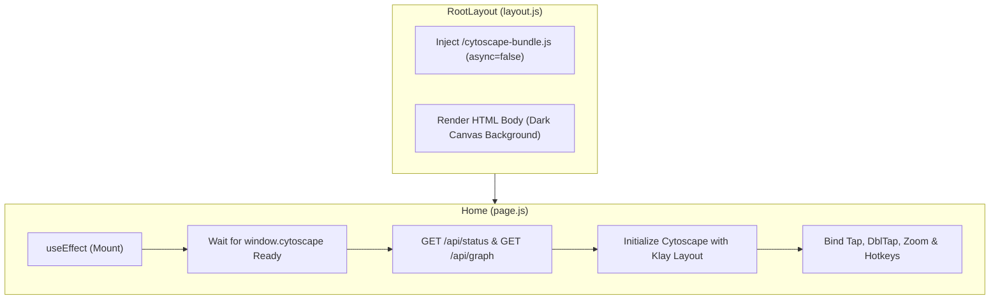
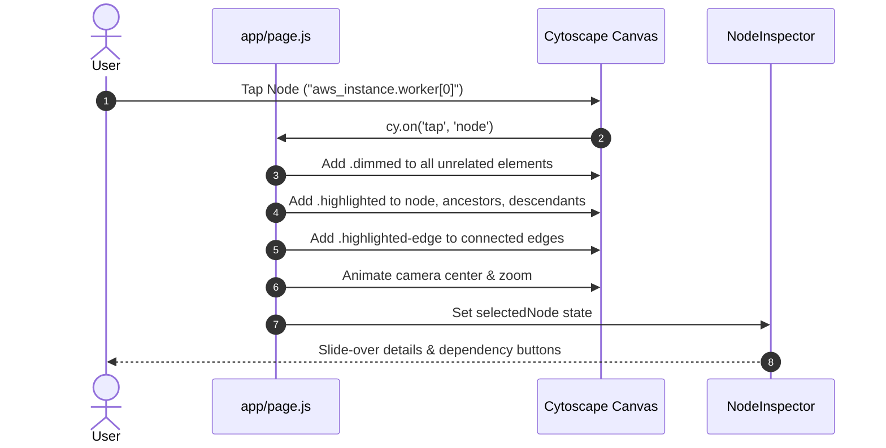
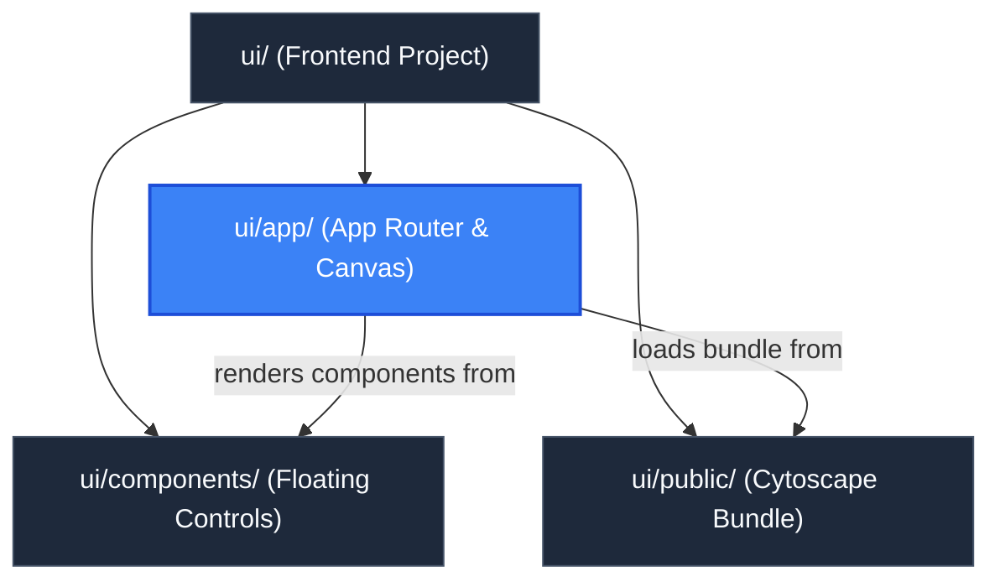

# App Router & Canvas Orchestration (`ui/app`)

> **Parent Documentation**: For the higher-level architecture, see [Frontend Application](../README.md)

The `ui/app` directory serves as the core Next.js App Router entry point for `plan-parse`. It defines the root HTML skeleton, injects global stylesheets, bundles synchronous script headers, and coordinates the primary Cytoscape.js rendering lifecycle in `page.js`.

---

## Architectural Mechanics

The app router implementation bridges Next.js server-side static export conventions with client-side, imperative Canvas/DOM manipulation.



---

## Key Modules & Implementation Details

### 1. Root Layout (`layout.js`)
- Injects a synchronous `<script src="/cytoscape-bundle.js" async={false}>` tag into `<head>`. This guarantees Cytoscape and the Eclipse Klay layout plugin are available in the browser's global scope before React mounts client components.
- Sets global viewport bounds (`w-screen h-screen overflow-hidden`) and applies the base dark slate background (`bg-slate-950 text-slate-100`).

### 2. Canvas Orchestrator (`page.js`)
`page.js` is a comprehensive client component (`"use client"`) managing graph state, animations, and overlays:
- **Cytoscape Instance Lifecycle**:
  Stores the live Cytoscape instance in `cyRef`. Whenever `graphData` updates, any existing instance is destroyed cleanly via `cy.destroy()` and rebuilt.
- **Klay Layout Engine**:
  Executes the Klay hierarchical layout:
  ```javascript
  const layout = cy.layout({
    name: "klay",
    nodeDimensionsIncludeLabels: true,
    fit: true,
    padding: 60,
    klay: {
      direction: "RIGHT",
      borderSpacing: 40,
      spacing: 30,
      nodeLayering: "NETWORK_SIMPLEX",
    },
  });
  layout.run();
  ```
- **Node Selection & Focus**:
  On tapping a node, the canvas extracts its upstream (`incomers`) and downstream (`outgoers`) dependencies, applies a `.dimmed` class (opacity 0.18) to all unrelated graph elements, highlights direct edges with glowing borders (`#38bdf8`), and animates the camera viewport to center on the selected element.
- **Double-Tap Quick Centering**:
  Double-tapping any node centers the camera and zooms in (`Math.max(cy.zoom(), 1.3)`).
- **Navigation Lock Synchronization**:
  When canvas lock is toggled, `userPanningEnabled` and `userZoomingEnabled` are updated dynamically.
- **Keyboard Shortcut Listener**:
  Registers global event handlers for `f` (fit), `+` (zoom in), `-` (zoom out), `0` (reset 1:1), and `Escape` (clear selection or close drawer).
- **Bidirectional Drawer Synchronization**:
  `page.js` coordinates state with `InputDrawer` by passing `graphData`, `selectedNode`, and the `onNavigateToNode` callback:
  - *Canvas to Drawer*: Tapping a node on the Cytoscape canvas updates `selectedNode`, which notifies `InputDrawer` to highlight the corresponding item and scroll it into view in the Resource Explorer list (`#res-item-${selectedNode.id}`).
  - *Drawer to Canvas*: Selecting or clicking a resource card in the `InputDrawer` invokes `handleNavigateToNode(nodeId)`, automatically panning the Cytoscape camera to the node, applying `.highlighted` and `.dimmed` styles, and opening the `NodeInspector`.
- **Empty Canvas Guidance State**:
  When no plan is loaded (`!hasGraph`) and the `InputDrawer` is collapsed (`!isDrawerOpen`), an onboarding glassmorphic guidance card is rendered in the center of the canvas offering a direct "Open Plan Input" button.

### 3. Global Styles (`globals.css`)
- Imports Tailwind CSS standard directives (`@tailwind base`, `@tailwind components`, `@tailwind utilities`).
- Defines custom canvas styles (`.canvas-bg`), configuring an SVG dot-matrix grid pattern inspired by React Flow.
- Implements custom dark-mode scrollbar utilities (`.custom-scrollbar` and Webkit scrollbars) for glassmorphic inspector panels, modals, and the `InputDrawer` resource list.

---

## Node Selection & Highlighting Flow



---

## Key Files & Exports

| File | Type | Description |
| :--- | :--- | :--- |
| `page.js` | React Component | Main visualizer page, managing Cytoscape initialization, event listeners, camera animations, and UI overlays. |
| `layout.js` | React Component | Root App Router layout loading `/cytoscape-bundle.js` and global styling. |
| `globals.css` | Stylesheet | Base CSS rules, canvas dot grid background, and custom utility classes. |

---

## Hierarchy & Reference Graph

This section connects to [UI Component Library](../components/README.md) for modular control panels, and [Public Static Assets](../public/README.md) for the Cytoscape bundle.


