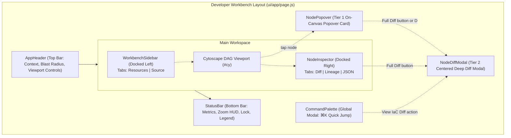
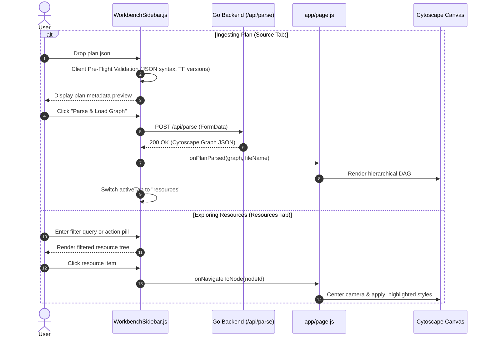
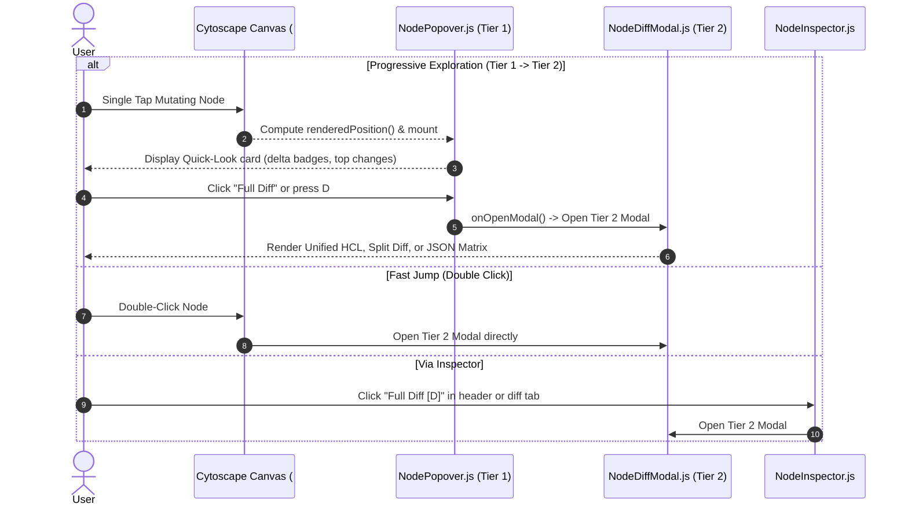
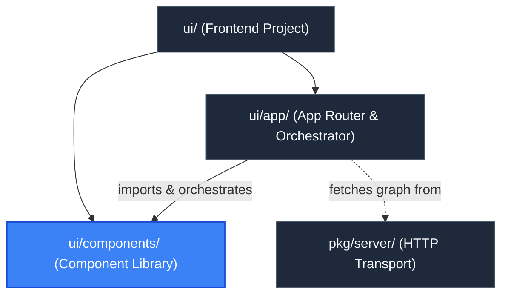

# UI Component Library (`ui/components`)

> **Parent Documentation**: For the higher-level architecture, see [Frontend Application](../README.md)

The `ui/components` directory contains the modular React components that construct the Developer Workbench for `plan-parse`. The interface utilizes a docked, IDE-style workbench layout consisting of a grounded top navigation header, docked collapsible side panels, an interactive Cytoscape canvas, a bottom engineering status bar, and a global command palette.

---

## Workbench Architecture & Layout Model

The workbench replaces legacy floating drawers with docked, high-density panels designed for deep architectural inspection:



---

## Component Catalog & Detailed Specifications

### 1. `AppHeader.js`
The persistent top navigation bar of the workbench. It anchors application branding, active plan context, blast-radius counters, and primary canvas action triggers.

- **Props**:
  | Prop | Type | Description |
  | :--- | :--- | :--- |
  | `cliLoaded` | `boolean` | Flag indicating whether the plan was pre-loaded via CLI (`-plan` or `-dir`). |
  | `planName` | `string` | Display name of the active plan or uploaded filename. |
  | `summary` | `PlanSummary` | Plan summary object containing action counts (`create`, `update`, `delete`, `replace`). |
  | `hasGraph` | `boolean` | Indicates whether graph nodes are currently rendered. |
  | `isSidebarOpen` | `boolean` | Controls sidebar visibility state. |
  | `onToggleSidebar` | `function` | Toggles left sidebar (`[` shortcut). |
  | `isInspectorOpen` | `boolean` | Controls right inspector panel visibility. |
  | `onToggleInspector` | `function` | Toggles right inspector panel (`]` shortcut). |
  | `onOpenCommandPalette` | `function` | Triggers the Command Palette modal (`⌘K`). |
  | `onOpenUpload` | `function` | Switches sidebar to the "source" ingestion tab. |
  | `onFit` | `function` | Re-centers and fits graph to canvas padding (`f`). |
  | `onResetZoom` | `function` | Resets canvas zoom to 100% (`0`). |
  | `onOpenShortcuts` | `function` | Triggers keyboard shortcuts cheat sheet modal (`?`). |
  | `onExportPng` | `function` | Exports the current graph canvas as a PNG image. |
  | `onExportSvg` | `function` | Exports the current graph canvas as an SVG vector image. |
  | `isExporting` | `string \| null` | Tracks active export format (`"png"` or `"svg"`). |
  | `isCollapsed` | `boolean` | Flag indicating whether non-mutating intermediate nodes are collapsed. |
  | `onToggleCollapse` | `function` | Toggles intermediate node collapse (`C`). |
  | `collapsedCount` | `number` | Count of hidden intermediate nodes. |
  | `theme` | `string` | Active theme (`"dark"` or `"light"`). |
  | `onToggleTheme` | `function` | Toggles workbench theme (`T`). |

- **UI Elements**:
  - **Context & Badges**: Displays `PLAN-PARSE` logo, `CLI Mode` amber badge (when pre-loaded), or plan filename.
  - **Blast Radius Micro-Chips**: Color-coded pill counters showing `+create` (green), `~update` (blue), `-delete` (red), and `±replace` (amber).
  - **Command Search Trigger**: Quick-access search input pill with `⌘K` badge.
  - **Controls**: `Fit`, `1:1`, `Load Plan`/`Replace Plan`, and inspector toggle buttons.

---

### 2. `WorkbenchSidebar.js`
The docked left-hand navigation and ingestion sidebar. Built with a dual-tab architecture to support both active resource exploration and drag-and-drop plan ingestion.

- **Props**:
  | Prop | Type | Description |
  | :--- | :--- | :--- |
  | `isOpen` | `boolean` | Sidebar visibility toggle. |
  | `onClose` | `function` | Closes the sidebar panel. |
  | `graphData` | `Graph` | The Cytoscape graph data object containing nodes, edges, and summary. |
  | `summary` | `PlanSummary` | Plan summary metrics. |
  | `cliLoaded` | `boolean` | Indicates if plan originated from CLI. |
  | `disabled` | `boolean` | Disables upload inputs when CLI plan is locked. |
  | `selectedNode` | `NodeData` | Currently selected node for two-way synchronization. |
  | `onNavigateToNode` | `function` | Callback to focus, center, and highlight a node on canvas. |
  | `onPlanParsed` | `function` | Callback invoked upon successful plan ingestion `(graph, fileName)`. |
  | `activeTab` | `string` | Active tab: `"resources"` or `"source"`. |
  | `onTabChange` | `function` | Callback to switch sidebar tabs. |

- **Dual-Tab Modes**:
  1. **Resources Tab (`"resources"`)**:
     - *Blast Radius Distribution Bar*: Segmented proportional bar visualizing action percentages across create, update, delete, replace, no-op, and read.
     - *Real-Time Filter*: Text query filter matching node ID, label, resource type, and module origin using `useDeferredValue` for smooth typing.
     - *Action Filter Chips*: Pill buttons filtering resources by action type (`all`, `create`, `update`, `delete`, `replace`, `no-op`, `read`).
     - *Module Grouping*: Toggle to group resources hierarchically by Terraform module origin.
     - *Two-Way Node Synchronization*: Automatically scrolls the matching resource card into view (`#tree-item-${selectedNode.id}`) when selected on the canvas.
  2. **Source Tab (`"source"`)**:
     - *Drag-and-Drop Dropzone*: Ingests raw `.json` plan files.
     - *Client-Side Pre-Flight Validation*:
       - File extension must end in `.json`.
       - Maximum payload ceiling of 50MB.
       - Rejects empty files.
       - Validates JSON syntax via `JSON.parse`.
       - Asserts non-empty `format_version` and `terraform_version` fields.
     - *Plan Metadata Card*: Previews inspected format version, Terraform version, and resource count before submitting.
     - *Stateless Upload*: Dispatches `POST /api/parse` via `FormData` and feeds returned DAG directly into canvas state.



---

### 3. `NodeInspector.js`
The docked right slide-over inspector panel. Provides deep architectural insight and attribute change verification for any selected node.

- **Props**:
  | Prop | Type | Description |
  | :--- | :--- | :--- |
  | `node` | `NodeData` | Selected node object containing ID, label, action, changeDetails, incomers, outgoers. |
  | `onClose` | `function` | Closes the inspector (`Escape` or close button). |
  | `onNavigateToNode` | `function` | Callback to jump camera focus to an upstream or downstream dependency node. |
  | `onOpenFullDiff` | `function` | Callback to open the Tier 2 `NodeDiffModal` (`D` shortcut or button click). |

- **Subsystem Tabs & Diff Actions**:
  1. **Attribute Diff Tab (`"diff"`)**:
     - Compares `before` and `after` resource configurations from Terraform's `changeDetails`.
     - Header "Full Diff [D]" button to promote the view directly into the Tier 2 deep modal.
     - Displays line-by-line colored diff rows:
       - `+ ADDED` (Emerald, green background)
       - `- REMOVED` (Rose, red background)
       - `~ MODIFIED` (Amber, yellow background with strikethrough before-values)
       - `= SAME` (Slate, unchanged properties)
  2. **Lineage Tab (`"lineage"`)**:
     - *Upstream Dependencies (`Depends On`)*: Lists all nodes that the active resource depends on (`outgoers`), with one-click `focus` navigation buttons.
     - *Blast Radius (`Referenced By`)*: Lists all downstream nodes that depend on the active resource (`incomers`), displaying blast-radius risk.
  3. **Raw JSON Tab (`"json"`)**:
     - Displays formatted, syntax-highlighted raw JSON attributes with a one-click "Copy Address" utility.

---

### 4. `StatusBar.js`
The grounded engineering status strip docked at the bottom of the viewport.

- **Props**:
  | Prop | Type | Description |
  | :--- | :--- | :--- |
  | `nodeCount` | `number` | Count of total nodes in the loaded graph. |
  | `edgeCount` | `number` | Count of total edges in the loaded graph. |
  | `zoomLevel` | `number` | Active Cytoscape camera zoom level (ratio). |
  | `onZoomIn` | `function` | Zoom in callback (+30%). |
  | `onZoomOut` | `function` | Zoom out callback (-25%). |
  | `isLocked` | `boolean` | Flag indicating whether viewport panning and zooming are locked. |
  | `onToggleLock` | `function` | Callback to toggle canvas navigation lock. |
  | `isCollapsed` | `boolean` | Flag indicating whether non-mutating intermediate nodes are collapsed. |
  | `collapsedCount` | `number` | Total number of collapsed non-mutating nodes. |
  | `bridgedCount` | `number` | Count of synthesized transitive dependency edges. |
  | `onOpenShortcuts` | `function` | Triggers keyboard shortcuts cheat sheet modal (`?`). |

- **Sections**:
  - **Left HUD**: Active graph metrics (`N nodes • N edges`), inline zoom percentage HUD (`100%`), inline `-`/`+` step zoom buttons, and `LOCKED`/`UNLOCKED` navigation toggle.
  - **Right HUD**: Color-coded action legend dots (create `#22c55e`, update `#3b82f6`, delete `#ef4444`, replace `#f59e0b`, no-op `#64748b`) and global shortcut hints (`⌘K search`, `f fit`).

---

### 5. `CommandPalette.js`
A global modal dialog triggered by `Cmd+K` / `Ctrl+K` for rapid keyboard-driven navigation across large infrastructure graphs.

- **Props**:
  | Prop | Type | Description |
  | :--- | :--- | :--- |
  | `isOpen` | `boolean` | Modal visibility state. |
  | `onClose` | `function` | Callback to dismiss the palette (`Escape` or backdrop click). |
  | `nodes` | `Array<Node>` | Complete array of graph nodes to search. |
  | `selectedNode` | `NodeData` | Currently selected node for contextual actions. |
  | `onSelectNode` | `function` | Callback invoked when an item is selected `(nodeId)`. |
  | `onOpenDiffModal` | `function` | Callback to trigger Tier 2 `NodeDiffModal` for the selected node. |
  | `onToggleCollapse` | `function` | Callback to toggle collapsed/mutating graph view (`C`). |
  | `isCollapsed` | `boolean` | Flag indicating whether non-mutating intermediate nodes are collapsed. |
  | `onToggleTheme` | `function` | Callback to toggle light/dark theme (`T`). |
  | `theme` | `string` | Current theme (`"dark"` or `"light"`). |
  | `onOpenShortcuts` | `function` | Callback to open the keyboard shortcuts modal (`?`). |

- **Features**:
  - **Keyboard Navigation**: Fully operable via `ArrowUp`, `ArrowDown`, `Enter` (select), and `Escape` (dismiss).
  - **Contextual Action Execution**: When a mutating node is selected, renders a dynamic `View IaC Diff: <selectedNode>` action (`D` shortcut), plus global commands for theme toggle (`T`), graph collapse (`C`), and shortcut help (`?`).
  - **Real-Time Fuzzy Matching**: Evaluates user queries against resource IDs, labels, resource types, action changes, and module names using `useDeferredValue`.
  - **Item Visualization**: Each result displays the resource action pill, resource label, module breadcrumb, and resource type badge.
  - **Auto-Scroll**: Keeps the active highlighted keyboard selection centered within view.

```mermaid
flowchart TD
    Hotkey["User presses Cmd+K / Ctrl+K"] --> Open["CommandPalette Opens (Input Focused)"]
    Open --> Type["User Types Search Query"]
    Type --> Deferred["useDeferredValue(query)"]
    Deferred --> Filter["Filter actions & nodes (ID, label, type, module, action)"]
    Filter --> Display["Display Top Matches"]
    Display --> Nav{"Keyboard Input"}
    Nav -->|ArrowUp / ArrowDown| Move["Cycle selectedIndex & Scroll into View"]
    Nav -->|Enter (Action)| Exec["Execute Action (e.g. Open Diff Modal, Toggle Theme)"]
    Nav -->|Enter (Node)| Select["onSelectNode(nodeId) -> Animate Camera"]
    Nav -->|Escape| Close["onClose()"]
```

---

### 6. `NodePopover.js`
Tier 1 on-canvas quick-look popover card. Positioned dynamically adjacent to the selected or hovered node on the Cytoscape canvas with viewport clamping.

- **Props**:
  | Prop | Type | Description |
  | :--- | :--- | :--- |
  | `node` | `NodeData` | Selected node object containing label, module, change type, and `changeDetails`. |
  | `position` | `{ x: number, y: number }` | Rendered canvas coordinates `node.renderedPosition()` for absolute placement. |
  | `onOpenModal` | `function` | Promotes view to Tier 2 `NodeDiffModal` (`Space` or `D`). |
  | `onClose` | `function` | Dismisses popover (`Escape` or canvas background click). |
  | `canvasWidth` | `number` | Active viewport width for boundary clamping (default: `1000`). |
  | `canvasHeight` | `number` | Active viewport height for boundary clamping (default: `700`). |

- **Key Mechanics**:
  - **Boundary Clamping**: Automatically detects canvas edges (`margin = 16`, `popoverWidth = 320`, `popoverHeight = 280`) and flips placement horizontally or vertically so the card is never clipped outside the visible viewport.
  - **Delta Counters**: Color-coded badges summarizing change metrics: `+N added` (emerald), `~N modified` (sky), `-N removed` (rose).
  - **Forces Replacement Alert**: Displays high-visibility amber warning when modifications trigger resource re-creation.
  - **Top Attribute Changes Preview**: Renders the top 3 modified properties with change symbols (`+`, `~`, `-`) and compact before/after summaries.
  - **Quick Dismissal**: Auto-dismisses on canvas `pan`, `zoom`, or background tap to preserve fluid graph navigation.

---

### 7. `NodeDiffModal.js`
Tier 2 deep IaC diff inspection modal. A centered, high-density dialog for inspecting complete Terraform Infrastructure-as-Code diffs.

- **Props**:
  | Prop | Type | Description |
  | :--- | :--- | :--- |
  | `isOpen` | `boolean` | Modal visibility state. |
  | `node` | `NodeData` | Complete node object with `changeDetails` and metadata. |
  | `onClose` | `function` | Dismisses modal (`Escape`, close button, or backdrop click). |

- **Subsystems & Viewing Modes**:
  1. **Header Breadcrumbs & Utilities**:
     - Hierarchical breadcrumbs (`Module > Resource Type > Resource Name`).
     - Source code file location (`node.file:node.line`).
     - Affirmative "Copy Address" and "Copy Diff" buttons with 1.6s visual feedback.
  2. **View Mode Switcher**:
     - **Unified HCL Diff**: Formatted Terraform CLI / HCL representation with sticky line gutters (`lineNum`, `symbol`) and syntax coloring for additions (`+`), removals (`-`), modifications (`~`), comments, and replacement badges.
     - **Side-by-Side (Split) HCL**: Dual-column state comparison (Left: Current State / Before / Deletions; Right: Planned State / After / Additions).
     - **Attributes JSON Matrix**: Filterable tabular matrix with search query input, "Changed Only" toggle, before/after values, and `(forces replacement)` flags.
  3. **Keyboard Controls**:
     - `Tab`: Cycles through view modes (Unified $\rightarrow$ Split $\rightarrow$ Matrix).
     - `Escape`: Closes the modal.
     - Input field guard: Prevents single-key canvas shortcuts (`Space`, `D`) from firing while typing inside attribute filter inputs.



---

## Hierarchy & Reference Graph

This package is coordinated directly by [App Router & Canvas Orchestration](../app/README.md) and renders graphs provided by [HTTP Server Package](../../pkg/server/README.md).


