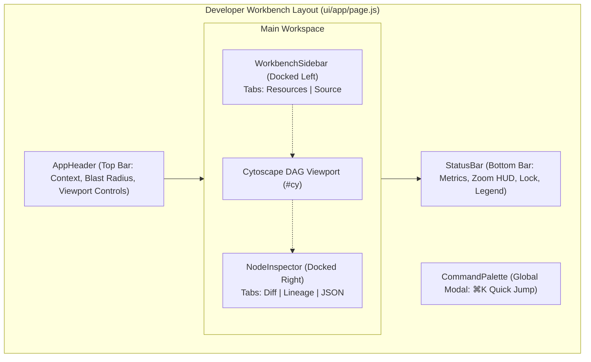
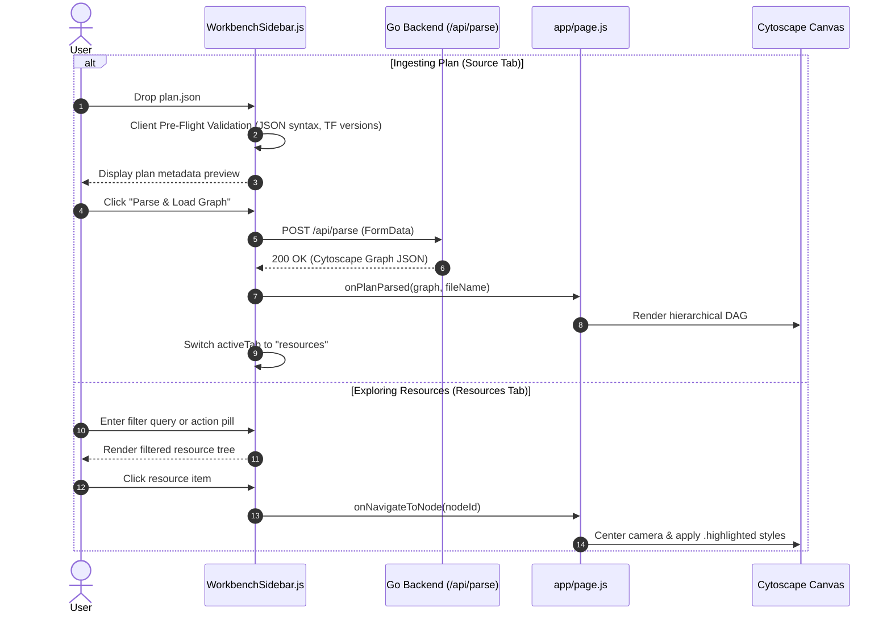
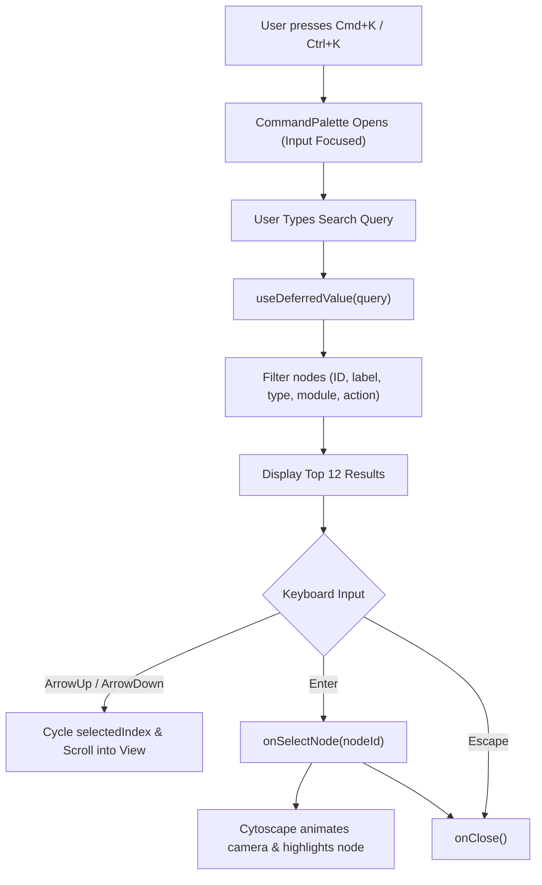
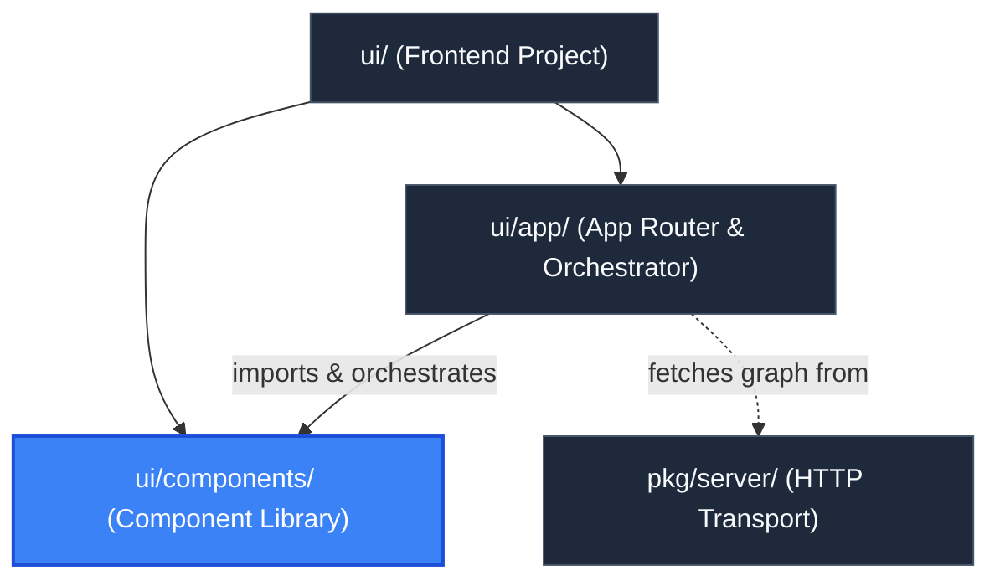

# UI Component Library (`ui/components`)

> **Parent Documentation**: For the higher-level architecture, see [Frontend Application](../README.md)

The `ui/components` directory contains the modular React components that construct the Developer Workbench for `plan-parse`. The interface utilizes a docked, IDE-style workbench layout consisting of a grounded top navigation header, docked collapsible side panels, an interactive Cytoscape canvas, a bottom engineering status bar, and a global command palette.

---

## Workbench Architecture & Layout Model

The workbench replaces legacy floating drawers with docked, high-density panels designed for deep architectural inspection:

---

## Component Catalog & Detailed Specifications

### 1. `AppHeader.js`
The persistent top navigation bar of the workbench. It anchors application branding, active plan context, blast-radius counters, and primary canvas action triggers.

- **Props**:
  | Prop | Type | Description |
  | :--- | :--- | :--- |
  | `cliLoaded` | `boolean` | Flag indicating whether the plan was pre-loaded via CLI (`-plan` or `-dir`). |
  | `planName` | `string` | Display name of the active plan or uploaded filename. |
  | `summary` | `PlanSummary` | Plan summary object containing action counts (`create`, `update`, `delete`, `replace`). |
  | `hasGraph` | `boolean` | Indicates whether graph nodes are currently rendered. |
  | `isSidebarOpen` | `boolean` | Controls sidebar visibility state. |
  | `onToggleSidebar` | `function` | Toggles left sidebar (`[` shortcut). |
  | `isInspectorOpen` | `boolean` | Controls right inspector panel visibility. |
  | `onToggleInspector` | `function` | Toggles right inspector panel (`]` shortcut). |
  | `onOpenCommandPalette` | `function` | Triggers the Command Palette modal (`⌘K`). |
  | `onOpenUpload` | `function` | Switches sidebar to the "source" ingestion tab. |
  | `onFit` | `function` | Re-centers and fits graph to canvas padding (`f`). |
  | `onResetZoom` | `function` | Resets canvas zoom to 100% (`0`). |

- **UI Elements**:
  - **Context & Badges**: Displays `PLAN-PARSE` logo, `CLI Mode` amber badge (when pre-loaded), or plan filename.
  - **Blast Radius Micro-Chips**: Color-coded pill counters showing `+create` (green), `~update` (blue), `-delete` (red), and `±replace` (amber).
  - **Command Search Trigger**: Quick-access search input pill with `⌘K` badge.
  - **Controls**: `Fit`, `1:1`, `Load Plan`/`Replace Plan`, and inspector toggle buttons.

---

### 2. `WorkbenchSidebar.js`
The docked left-hand navigation and ingestion sidebar. Built with a dual-tab architecture to support both active resource exploration and drag-and-drop plan ingestion.

- **Props**:
  | Prop | Type | Description |
  | :--- | :--- | :--- |
  | `isOpen` | `boolean` | Sidebar visibility toggle. |
  | `onClose` | `function` | Closes the sidebar panel. |
  | `graphData` | `Graph` | The Cytoscape graph data object containing nodes, edges, and summary. |
  | `summary` | `PlanSummary` | Plan summary metrics. |
  | `cliLoaded` | `boolean` | Indicates if plan originated from CLI. |
  | `disabled` | `boolean` | Disables upload inputs when CLI plan is locked. |
  | `selectedNode` | `NodeData` | Currently selected node for two-way synchronization. |
  | `onNavigateToNode` | `function` | Callback to focus, center, and highlight a node on canvas. |
  | `onPlanParsed` | `function` | Callback invoked upon successful plan ingestion `(graph, fileName)`. |
  | `activeTab` | `string` | Active tab: `"resources"` or `"source"`. |
  | `onTabChange` | `function` | Callback to switch sidebar tabs. |

- **Dual-Tab Modes**:
  1. **Resources Tab (`"resources"`)**:
     - *Blast Radius Distribution Bar*: Segmented proportional bar visualizing action percentages across create, update, delete, replace, no-op, and read.
     - *Real-Time Filter*: Text query filter matching node ID, label, resource type, and module origin using `useDeferredValue` for smooth typing.
     - *Action Filter Chips*: Pill buttons filtering resources by action type (`all`, `create`, `update`, `delete`, `replace`, `no-op`, `read`).
     - *Module Grouping*: Toggle to group resources hierarchically by Terraform module origin.
     - *Two-Way Node Synchronization*: Automatically scrolls the matching resource card into view (`#tree-item-${selectedNode.id}`) when selected on the canvas.
  2. **Source Tab (`"source"`)**:
     - *Drag-and-Drop Dropzone*: Ingests raw `.json` plan files.
     - *Client-Side Pre-Flight Validation*:
       - File extension must end in `.json`.
       - Maximum payload ceiling of 50MB.
       - Rejects empty files.
       - Validates JSON syntax via `JSON.parse`.
       - Asserts non-empty `format_version` and `terraform_version` fields.
     - *Plan Metadata Card*: Previews inspected format version, Terraform version, and resource count before submitting.
     - *Stateless Upload*: Dispatches `POST /api/parse` via `FormData` and feeds returned DAG directly into canvas state.

---

### 3. `NodeInspector.js`
The docked right slide-over inspector panel. Provides deep architectural insight and attribute change verification for any selected node.

- **Props**:
  | Prop | Type | Description |
  | :--- | :--- | :--- |
  | `node` | `NodeData` | Selected node object containing ID, label, action, changeDetails, incomers, outgoers. |
  | `onClose` | `function` | Closes the inspector (`Escape` or close button). |
  | `onNavigateToNode` | `function` | Callback to jump camera focus to an upstream or downstream dependency node. |

- **Subsystem Tabs**:
  1. **Attribute Diff Tab (`"diff"`)**:
     - Compares `before` and `after` resource configurations from Terraform's `changeDetails`.
     - Displays line-by-line colored diff rows:
       - `+ ADDED` (Emerald, green background)
       - `- REMOVED` (Rose, red background)
       - `~ MODIFIED` (Amber, yellow background with strikethrough before-values)
       - `= SAME` (Slate, unchanged properties)
  2. **Lineage Tab (`"lineage"`)**:
     - *Upstream Dependencies (`Depends On`)*: Lists all nodes that the active resource depends on (`outgoers`), with one-click `focus` navigation buttons.
     - *Blast Radius (`Referenced By`)*: Lists all downstream nodes that depend on the active resource (`incomers`), displaying blast-radius risk.
  3. **Raw JSON Tab (`"json"`)**:
     - Displays formatted, syntax-highlighted raw JSON attributes with a one-click "Copy Address" utility.

---

### 4. `StatusBar.js`
The grounded engineering status strip docked at the bottom of the viewport.

- **Props**:
  | Prop | Type | Description |
  | :--- | :--- | :--- |
  | `nodeCount` | `number` | Count of total nodes in the loaded graph. |
  | `edgeCount` | `number` | Count of total edges in the loaded graph. |
  | `zoomLevel` | `number` | Active Cytoscape camera zoom level (ratio). |
  | `onZoomIn` | `function` | Zoom in callback (+30%). |
  | `onZoomOut` | `function` | Zoom out callback (-25%). |
  | `isLocked` | `boolean` | Flag indicating whether viewport panning and zooming are locked. |
  | `onToggleLock` | `function` | Callback to toggle canvas navigation lock. |

- **Sections**:
  - **Left HUD**: Active graph metrics (`N nodes • N edges`), inline zoom percentage HUD (`100%`), inline `-`/`+` step zoom buttons, and `LOCKED`/`UNLOCKED` navigation toggle.
  - **Right HUD**: Color-coded action legend dots (create `#22c55e`, update `#3b82f6`, delete `#ef4444`, replace `#f59e0b`, no-op `#64748b`) and global shortcut hints (`⌘K search`, `f fit`).

---

### 5. `CommandPalette.js`
A global modal dialog triggered by `Cmd+K` / `Ctrl+K` for rapid keyboard-driven navigation across large infrastructure graphs.

- **Props**:
  | Prop | Type | Description |
  | :--- | :--- | :--- |
  | `isOpen` | `boolean` | Modal visibility state. |
  | `onClose` | `function` | Callback to dismiss the palette (`Escape` or backdrop click). |
  | `nodes` | `Array<Node>` | Complete array of graph nodes to search. |
  | `onSelectNode` | `function` | Callback invoked when an item is selected `(nodeId)`. |

- **Features**:
  - **Keyboard Navigation**: Fully operable via `ArrowUp`, `ArrowDown`, `Enter` (select), and `Escape` (dismiss).
  - **Real-Time Fuzzy Matching**: Evaluates user queries against resource IDs, labels, resource types, action changes, and module names using `useDeferredValue`.
  - **Item Visualization**: Each result displays the resource action pill, resource label, module breadcrumb, and resource type badge.
  - **Auto-Scroll**: Keeps the active highlighted keyboard selection centered within view.

---

## Hierarchy & Reference Graph

This package is coordinated directly by [App Router & Canvas Orchestration](../app/README.md) and renders graphs provided by [HTTP Server Package](../../pkg/server/README.md).

