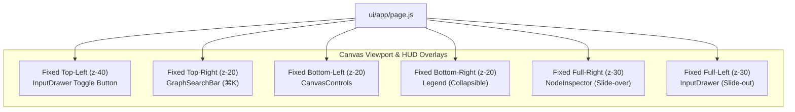
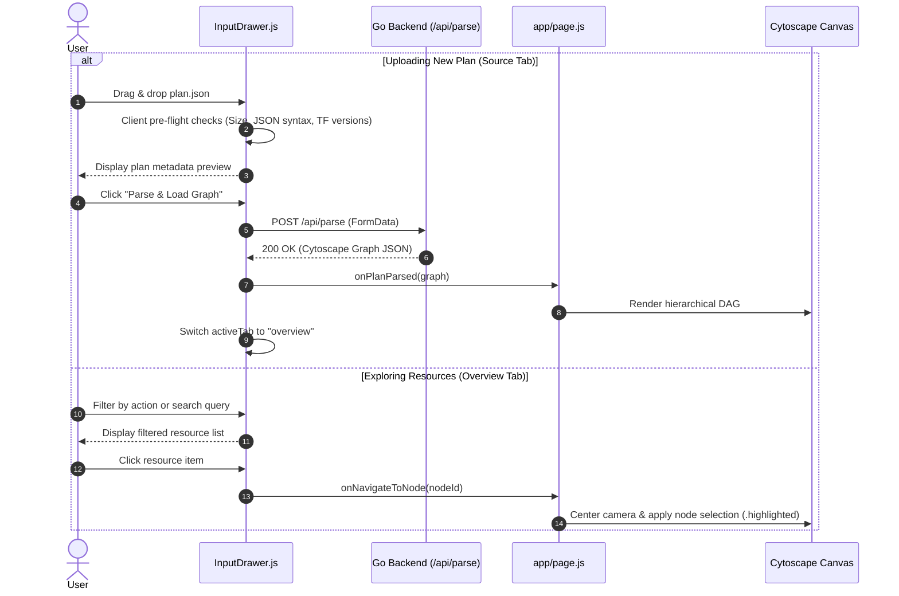
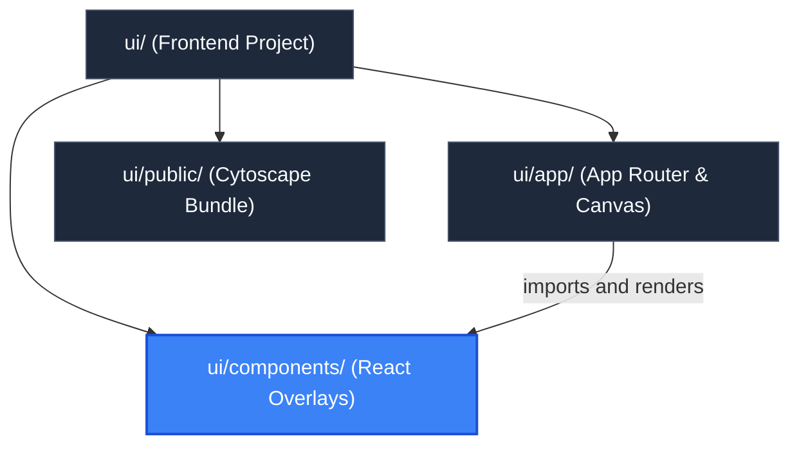

# UI Component Library (`ui/components`)

> **Parent Documentation**: For the higher-level architecture, see [Frontend Application](../README.md)

The `ui/components` directory contains the modular React UI components that comprise the head-up display (HUD), navigation controls, inspectors, and modal drawers of `plan-parse`. Designed with Tailwind CSS and glassmorphism styling, each component encapsulates a specific user interaction pattern while communicating state changes upward to the canvas orchestrator in `ui/app/page.js`.

---

## Component Architecture & HUD Layout

The UI components float above the Cytoscape canvas layer using fixed CSS coordinates and distinct z-index layers.

---

## Component Catalog & Internal Mechanics

### 1. `InputDrawer.js`
A floating, collapsible glassmorphic panel functioning as both an interactive plan overview / resource explorer and a plan file ingestion workflow. Designed with a dual-tab architecture:

#### Overview Tab (`activeTab === "overview"`)
Rendered when a graph is loaded or actively explored:
- **Action Distribution Bar**: A proportional segmented bar displaying visual percentages and counts across all 6 Terraform change action types with distinctive colors and symbols:
  - Create (`#22c55e`, `+`)
  - Update (`#3b82f6`, `~`)
  - Delete (`#ef4444`, `-`)
  - Replace (`#f59e0b`, `±`)
  - No-op (`#64748b`, `=`)
  - Read (`#ec4899`, `?`)
- **Metric Cards Grid**: Quick-summary counter cards for each action type with color-coded badges and totals.
- **Resource Explorer**:
  - *Real-Time Filter & Search*: Instant filtering across resource leaf nodes by text query (matching ID, label, resource type, resource name, or module origin) and action category dropdown (`all`, `create`, `update`, `delete`, `replace`, `no-op`, `read`).
  - *Click-to-Navigate*: Clicking any resource card triggers `onNavigateToNode(nodeId)`, centering the Cytoscape camera viewport and focusing on the target node.
  - *Active Node Synchronization*: Automatically tracks `selectedNode` from canvas taps, highlighting the active resource card and smoothly scrolling it into view (`res-item-${selectedNode.id}`).

#### Source Tab (`activeTab === "source"`)
Dedicated to uploading, validating, and submitting Terraform plan JSON files:
- **Client-Side Pre-Flight Validation**:
  Before dispatching network requests to the Go backend, `validateFileContent()` performs 5 pre-flight verification checks:
  1. *Extension Validation*: Enforces `.json` file extension.
  2. *Payload Bound Check*: Rejects payloads exceeding the 50MB ceiling.
  3. *Empty File Guard*: Rejects zero-byte files.
  4. *JSON Syntax Verification*: Parses payload text with `JSON.parse` to trap malformed syntax.
  5. *Terraform Schema Assertion*: Asserts the presence of non-empty `format_version` and `terraform_version` fields.
- **Plan File Metadata Summary**: Displays inspected plan attributes including file size, format version, Terraform version, and total `resource_changes` count before submission.
- **CLI Preloaded State Management**: When the backend starts with `--plan`, displays an active CLI status badge, locks file inputs to prevent accidental overwrites, and exposes an unlock button to switch into custom upload mode.
- **Submission**: Sends valid files via `multipart/form-data` to `POST /api/parse`, passing the returned graph to `onPlanParsed(graph)`.

### 2. `CanvasControls.js`
A React Flow-inspired floating control bar positioned at the bottom-left of the viewport.
- **Props**:
  - `zoomLevel` (*number*): Current Cytoscape viewport zoom factor.
  - `onZoomIn` / `onZoomOut` (*function*): Zoom callbacks with smooth cubic animations.
  - `onFit` (*function*): Fits all elements within screen bounds with 50px padding.
  - `onResetZoom` (*function*): Restores zoom factor to 1.0 (1:1 scale).
  - `isLocked` (*boolean*): Toggles panning and mousewheel zooming on the canvas.
  - `onToggleLock` (*function*): Disables or enables canvas user interactions.
- **Dynamic HUD**: Renders a live zoom percentage badge (e.g. `125%`).

### 3. `GraphSearchBar.js`
A high-efficiency resource locator positioned at the top-right of the viewport.
- **Keyboard Shortcut**: Automatically captures `⌘K` or `Ctrl+K` to focus the search input.
- **Fuzzy Search & Autocomplete**: Filters through all leaf and module nodes matching `id`, `label`, or `type`.
- **Navigation Dispatch**: Selecting an entry invokes `onSelectNode(nodeId)`, which animates the canvas camera to center on the target node.

### 4. `NodeInspector.js`
A slide-over drawer anchored to the right edge of the screen that opens when any node is tapped.
- **Node Metadata**: Displays resource type, logical label, full Terraform address, and source code location (`file:line`).
- **Action Badge**: Color-coded badge reflecting the change action (`create`, `update`, `delete`, `replace`, etc.).
- **Dependency Navigation**:
  - *Depends On (`outgoers`)*: Lists upstream resources this node depends upon with clickable "view" buttons that jump to each target.
  - *Referenced By (`incomers`)*: Lists downstream resources dependent upon this node.
- **Attribute Diff Inspector**: Formats `before` and `after` attribute state as syntax-highlighted JSON.

### 5. `Legend.js`
A collapsible bottom-right overlay documenting the color palette used for graph nodes and gradient edges:
- `create` (`#22c55e`), `update` (`#3b82f6`), `delete` (`#ef4444`), `replace` (`#f59e0b`), `no-op` (`#64748b`), `data` (`#ec4899`), `module` (`#a855f7`), `variable` (`#0ea5e9`), `output` (`#eab308`).

---

## Key Files & Exports

| Component File | Export | Primary Role |
| :--- | :--- | :--- |
| `InputDrawer.js` | `default InputDrawer` | Floating dual-tab panel providing plan JSON ingestion/validation and interactive resource exploration with action metrics. |
| `CanvasControls.js` | `default CanvasControls` | Floating React Flow-style viewport controls (zoom, fit, 1:1, lock, percentage HUD). |
| `GraphSearchBar.js` | `default GraphSearchBar` | Autocomplete resource finder with global `⌘K` hotkey and camera focus callbacks. |
| `NodeInspector.js` | `default NodeInspector` | Detail slide-over panel displaying resource diffs, module origins, and dependency links. |
| `Legend.js` | `default Legend` | Collapsible reference card explaining graph node and edge action colors. |

---

## Hierarchy & Reference Graph

This section connects to [Canvas Page](../app/README.md) which mounts and coordinates these components, and [Public Static Assets](../public/README.md) for supporting bundle resources.

