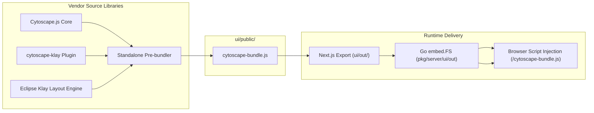
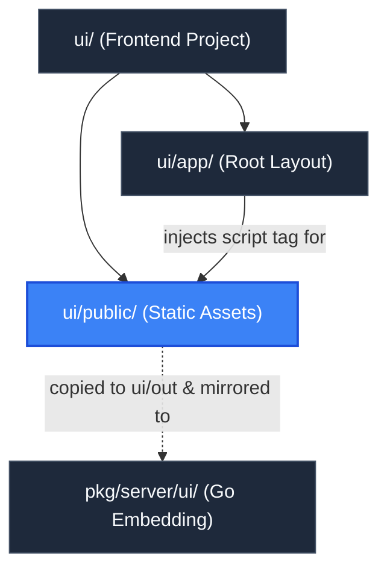

# Public Static Assets (`ui/public`)

> **Parent Documentation**: For the higher-level architecture, see [Frontend Application](../README.md)

The `ui/public` directory stores static, uncompiled assets that are served directly at the root URL path (`/`) by Next.js and the embedded Go HTTP server. Its primary asset is `cytoscape-bundle.js`, a standalone, pre-bundled distribution of the Cytoscape graph library and the Eclipse Klay hierarchical layout algorithm.

---

## Architecture & Rationale for Pre-Bundling

In complex React applications, heavy graph layout libraries like Cytoscape and Eclipse Klay (`klayjs`) introduce unique bundling challenges:
1. **Server-Side Rendering (SSR) Incompatibility**: Klay assumes a DOM or browser-like environment and interacts with global window objects.
2. **Webpack Transpilation Overhead**: Bundling `klayjs` through Next.js Webpack configs can lead to build timeouts, large chunk fragmentation, and module resolution issues.
3. **Synchronous Execution Guarantee**: By pre-bundling Cytoscape and the Klay plugin into a single standalone file, `plan-parse` guarantees that `window.cytoscape` is initialized before client React components mount.



---

## Loading Mechanics in the Application

1. **HTML Head Injection**:
   In `ui/app/layout.js`, the script is declared with `async={false}`:
   ```html
   <script src="/cytoscape-bundle.js" async={false}></script>
   ```
2. **Readiness Check**:
   In `ui/app/page.js`, a lightweight readiness probe checks `window.cytoscape` before initializing the canvas:
   ```javascript
   useEffect(() => {
     if (typeof window === "undefined") return;
     if (window.cytoscape) {
       setCyReady(true);
       return;
     }
     const interval = setInterval(() => {
       if (window.cytoscape) {
         setCyReady(true);
         clearInterval(interval);
       }
     }, 50);
     return () => clearInterval(interval);
   }, []);
   ```

---

## Key Files & Assets

| Asset File | Size | Role & Description |
| :--- | :--- | :--- |
| `cytoscape-bundle.js` | ~600 KB | Pre-packaged production bundle exporting `window.cytoscape` with the `klay` layout extension pre-registered. |

---

## Hierarchy & Reference Graph

This section connects to [Root Layout](../app/README.md) which loads the bundle via script tag, and [Embedded Distribution](../../pkg/server/ui/README.md) where it is packaged into the Go binary.


